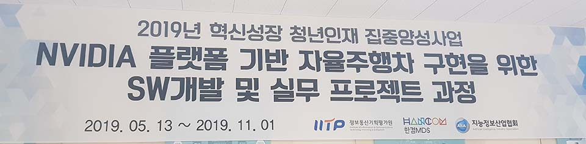
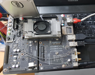

# SW개발 및 실무 프로젝트 과정

***NVIDIA 플랫폼 기반 자율주행차 구현을 위한 SW개발 및 실무프로젝트 과정*** with 한컴아카데미/(구)한컴MDS

  

* [2018년 IITP 혁신성장 청년인재 집중양성 - 자율주행차 H/W와 S/W 플랫폼 개발 전문가 및 실무프로젝트 과정](https://ezone.iitp.kr/common/co_0701/view?PMS_TSK_DGR_ID=2018-0-01743-001&cPage=&PMS_SRCHCHOICE1=ALL&PMS_SRCHTEXT1=&PMS_SRCHCHOICE2=&PMS_SRCHTEXT2=%ED%95%9C%EC%BB%B4&PMS_BEGDT=&PMS_ENDDT=&PMS_CHECK1=&PMS_CHECK2=&PMS_CHECK3=) 으로 시작
* 우리는 두 번째인 [2019년 IITP 혁신성장 청년인재 집중양성 - NVIDIA 플랫폼 기반 자율주행차 구현을 위한 SW개발 및 실무프로젝트 과정](https://ezone.iitp.kr/common/co_0701/view?PMS_TSK_DGR_ID=2019-0-01156-003&cPage=&PMS_SRCHCHOICE1=ALL&PMS_SRCHTEXT1=&PMS_SRCHCHOICE2=&PMS_SRCHTEXT2=%ED%95%9C%EC%BB%B4&PMS_BEGDT=&PMS_ENDDT=&PMS_CHECK1=&PMS_CHECK2=&PMS_CHECK3=)
* [2021년 현재 뽑는 한컴아카데미, 상세 커리큘럼](http://www.saraminimage.co.kr/recruit/bbs_recruit4/hcmds_210309_recruit01.html)

* (.feat Thor수업에 임하는 나의 자세)

>"Never give up. Without commitment, you’ll never start, but more importantly, without consistency, you’ll never finish. It’s not easy. Keep working. Keep striving. Never give up. Fall down seven times, get up eight. Ease is a greater threat to progress than hardship, so keep moving, keep growing, keep learning. See you at work.”
>
>"절대 포기하지 마세요. 헌신없이는 그 무엇도 시작할 수 없어요. 더 중요한 것은 꾸준함 없이는 결코 그 무엇도 끝낼 수 없다는 거죠. 그것은 쉽지 않습니다. 그래도 계속 하세요. 노력하세요. 결코 포기하지 마세요. 7번 넘어지면 8번 일어나세요. 성장을 방해하는 가장 큰 적은 편안함입니다. 계속 움직이고, 계속 성장하고, 계속 배워나가세요." ***덴젤워싱턴***

## 교육과정 그리고 정리

* 총 6개월 과정 (일 8시간, 총 24주)
* 단계별로 NVIDIA 플렛폼의 여러 보드를 다루면서 학습하고 Embedded 환경에서 머신러닝을 가지고 전력최적화 s/w최적화를 이루며 스스로 주행하는 차량구현을 모토로 한다.
* 4개월의 교육과정을 거치고 2개월의 실 프로젝트를 진행한다. 해당 기업에서 직접 개발을 진행한다거나 교육을 진행하거나
* 작년에 함께 했던 맨토는 유라, 경신 같은 자율주행에 관심많은 전장 1티어(그래서 이쪽으로 취업을 많이 갔다)

>버티는게 이기는거다. 매일매일 쏟아지는 지식들 속에서 흘려 버릴건 흘리고 새로운 걸로 다시 퐉퐉 채우면서 정리를 하자! 나중에 다시 보고 되새김하며 주어담길 바라며 ***과정이 끝날 즈음 남우에게 시작 때 남우가***

## 6개월 중 4개월 교육

* 전체 교육기간 5월 13일 ~ 11월 1일
* 5월 13일 ~ 8월31일 까지 교육 + 주간 프로젝트

| Week| course             |        Abstract        |실습장비|강사님|
|:---:| :-----------------: | :-------------: |:---:|:---:|
| 0| [OT](./courses/OT.md)                 |첫 오리엔테이션
| 1| [C Programming](./courses/w01.md)        | C, 자료구조, 알고리즘||김성영|
| 2| [Embedded C](./courses/w02.md)           | Embedded 최적화|ARM9 S3C2450, MDS2450 |김성영|
| 3| [C++ Programming ](./courses/w03.md)     | C++언어 집중교육    ||서광원|
| 4| [Python Programming ](./courses/w04.md)  | 네트워크, GUI||서영진|
| 5| [차량용 프로세서 디바이스제어](./courses/w05.md)| 임베디드 리눅스, ARM 이해 |ARM9 S3C2450, MDS2450|홍영기|
| 6| [차량용 프로세서 이해 및 활용](./courses/w06.md)| 리눅스 포팅, 어셈블리어 실습|ARM9 S3C2450, MDS2450|홍영기|
| 7| [차량용 OS 시스템 프로그래밍]           | 리눅스 시스템 프로그래밍|ARM9 S3C2450, MDS2450 |서광원|
| 8| [자율주행기능구현을위한차량용SW개발]     |인피니온보드 시스템 이해 그리고 실습|Infineon AURIX TC27CA, Lauterbach Trace32|황호현
| 9| [차량용 OS 디바이스 프로그래밍]         |모듈, 디바이스 드라이버|ARM9 S3C2450, MDS2450|김성영
|10| [자율주행 개발을 위한 OpenCV](./courses/w10.md)|차선 인식, 추출, 검출, 재구성||왕진영
|11| [ROS활용 및 QT프로그래밍](./courses/w11.md)           |SLAM, QT멀티쓰레드|Raspberry Pi3|유신|
|12| [NVIDIA TX보드를 활용한 딥러닝의 이해](./courses/w12.md)|Deep Learning, Tensorflow|NVIDIA Jetson TX1|최희욱|
|13| [Digits서버와 Nvidia TX기반의 영상처리 딥러닝](./courses/w13.md)|Digits, Detection, Segmentation |NVIDIA TX1,TX2, Digits Server|김혜진|
|14| [Drive PX2 딥러닝을 활용한 ADAS 개발](./courses/w14.md)|ADAS|NVIDIA Drive PX2|김혜진|
|15| [자율주행 상황인지를 위한 TF Object Detection](./courses/w15.md)|SSD, Yolo|NVIDIA TX2, Xavier|김혜진, 왕진영|
|16| [자율주행 모형차를 활용한 자율주행기술구현](./courses/w16.md)|제어, ros, gazebo|모형차|김혜진,자이트론 대표님|
|..| 팀 프로젝트 진행 | 앞으로 두달 더 |

## 6개월 중 2개월 프로젝트

* 5월13일 부터 11월1일 중 9월 2일부터 시작되는 프로젝트
* 2개월간 하나의 주제를 가지고 ***맨토*** 님과 함께 2명~4명이 하나의 팀으로 진행  

### 1조

* [발표영상](https://www.youtube.com/watch?v=PGaRAnsXU5g)
* 발표자: 강우성(현 SK텔레시스)
* 주제: Multi Robot SLAM

### 2조

* [시연영상](https://www.youtube.com/watch?v=pBnLHHB0mOU)
* [발표영상](https://youtu.be/ZcywU-9OZkA)
* 발표자: 백경호(현 네이버랩스)
* 주제: Restaurant Serving Robot

### 3팀

* [시연영상](https://youtu.be/8st7E7VzmOo)
* [발표영상](https://www.youtube.com/watch?v=1hkxfiee9Ss)
* 발표자: [김민준](https://github.com/KimMinJoon)(현 엑시스소프트웨어엔지니어링)
* 주제: 물류이동로봇 프로젝트 

### 4팀

* [시연영상](https://www.youtube.com/watch?v=UlhkYoAeIZ0)
* [발표영상](https://www.youtube.com/watch?v=5HDZMsNohss)
* 발표자: 송재필()
* 주제: Dog Biometric Identity Recognition System

### 5팀

* [발표영상](https://www.youtube.com/watch?v=sRpzDEI7cE0)
* 발표자: 조윤형()
* 주제: Auto Pirot

### 6팀

* [발표영상](https://www.youtube.com/watch?v=Joh9nEMu7hM)
* 발표자: 이현민(현 에스더블유엠)

<!-- 
| Week| course             |        Abstract        |강사님|
|:---:| :-----------------: | :-------------: |:---:|
| | |

<!-- | ||| -->
<!-- | || 

* 사용 칩, 보드 상세정보
* 강사님 상세정보

***정리 밀렸다.. 다시 하나씩 복구 시작!***

-->

## 아카데미 동기들 GITHUB

<!-- * 현재 총원 23명
* git 을 전혀 안쓰는 친구들이 대부분 아니 거의 전부였기에
  1. 열심히 전파해서 가입도모!
  2. Team Proj 진행!
  3. 그리고 merge의 세계로 ~~ 빠뜨리쟈!
     * 이땐 크라켄? 소스트리? -->

|  샘  |                                      |                                     |                                      |       |                                    |                문                |
|:---:| :----------------------------------: | :---------------------------------: | :----------------------------------: | :---: | :--------------------------------: | :-----------------------------: |
|      | [재필](https://github.com/seomyunfeel) | [이경](https://github.com/leekyung91) | [창호](https://github.com/changhonam)  |       |  [윤수](https://github.com/susu210)  | [한빈](https://github.com/Mombin) |
| 우성 | [민준](https://github.com/KimMinJoon)  |   [남우](https://github.com/NamWoo)   | [봉준](https://github.com/iambongjun)  |       | [동훈](https://github.com/d-h-k)|                                 |
| 윤형 |        |   [경호](https://github.com/bkh751)   | [태우](https://github.com/taewookimmr) |       | [보경](https://github.com/boku-kim)  |                                 |
|      |   [지선](https://github.com/LJSsun)    | [소현](https://github.com/So-Is-Cow)  |  [민지](https://github.com/youminji)   |       |                 [현민](https://github.com/wellmin11)                 |                                 |
| 강석 |                                      |[기찬](https://github.com/allowme2)|  |       |                 지윤                 |               규식                |

* 최초시작 25명, 현재는 22명
  * 선 취업 2명(3주차, [8주차](https://github.com/chrno0621))
  * 더 넓은 세상으로(=중도포기) 1명(2주차)

<!-- * 취업성공
  * [용준](https://github.com/chrno0621)
   -->
