# OT

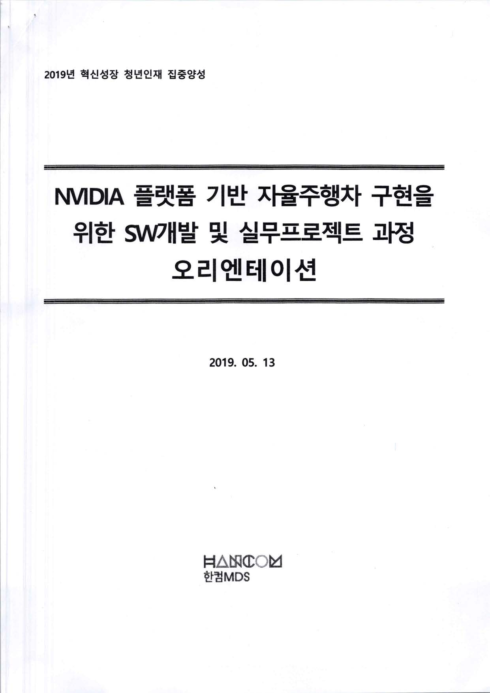
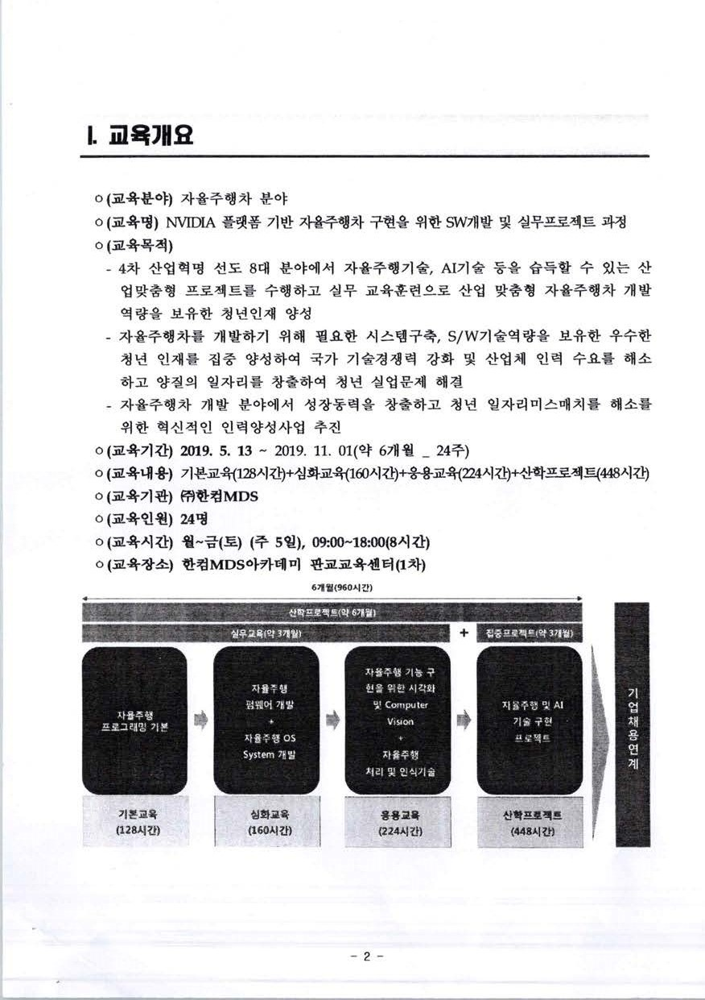
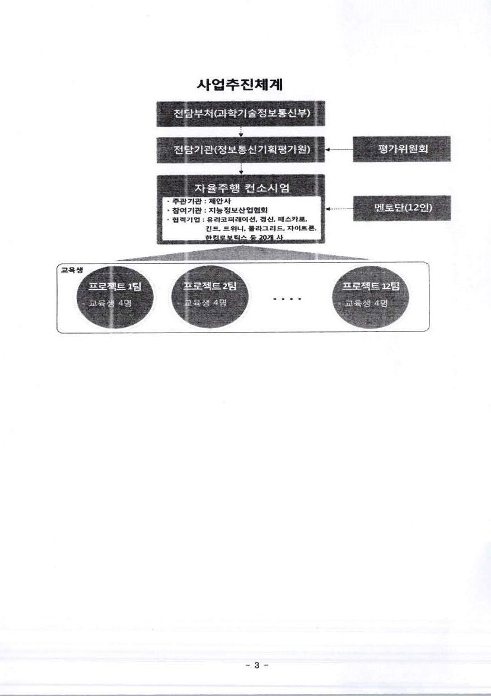
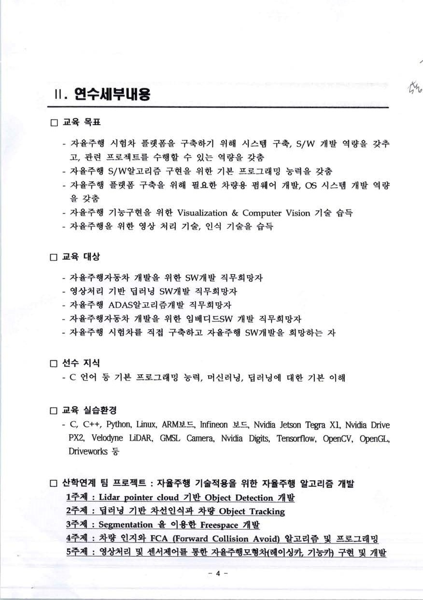
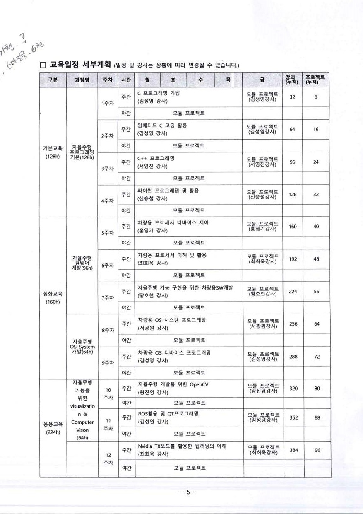

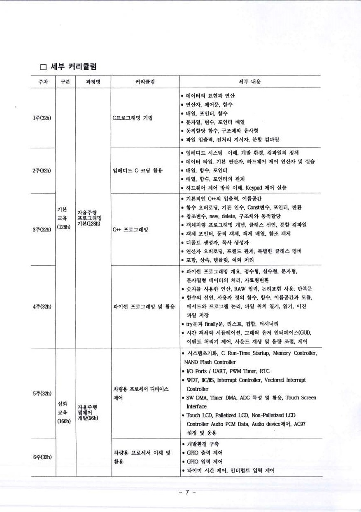
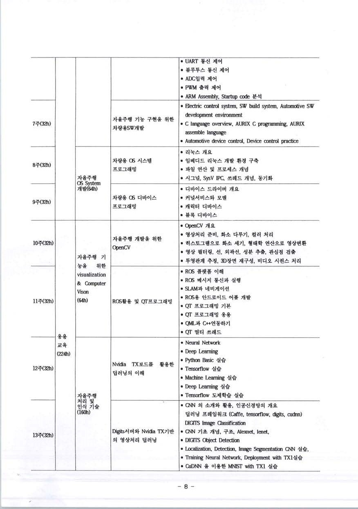
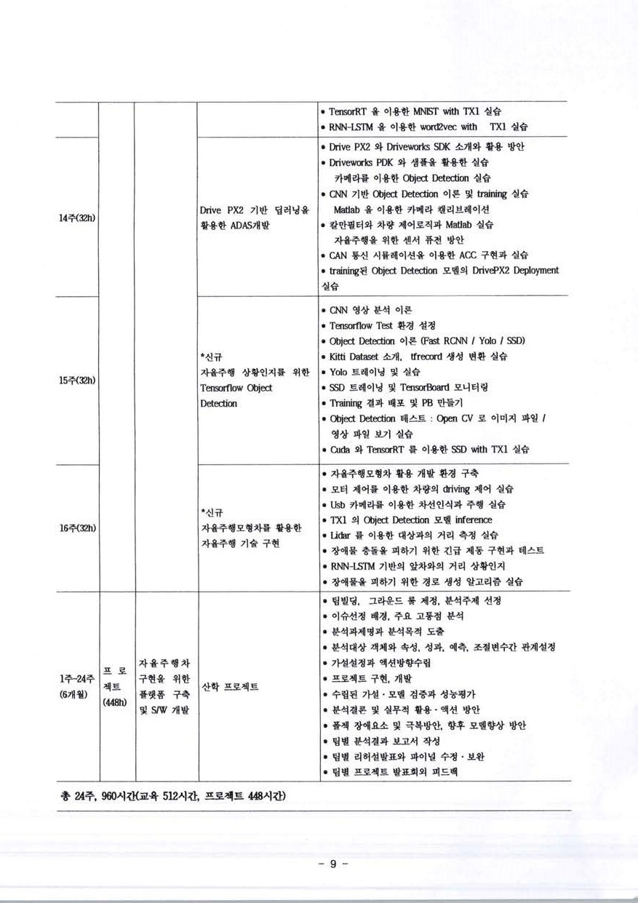
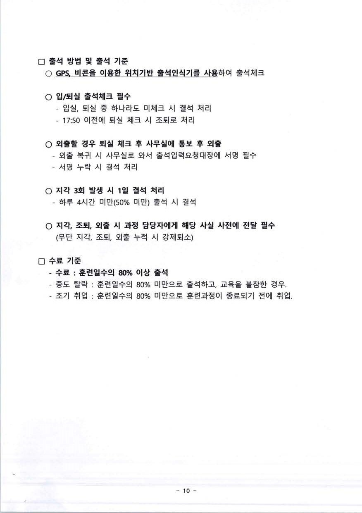
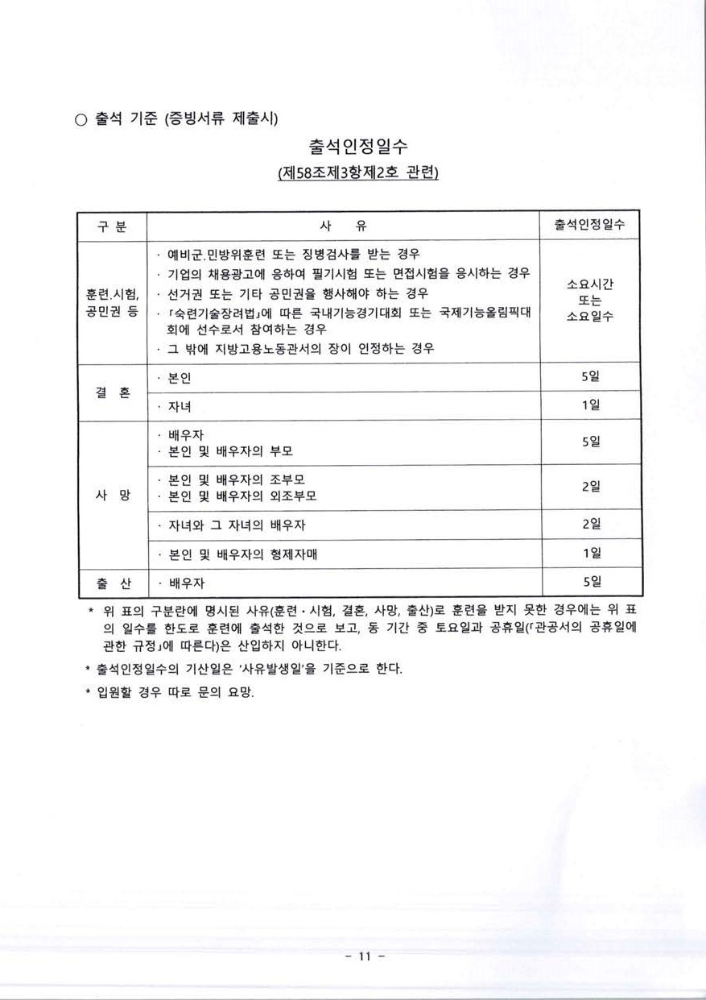
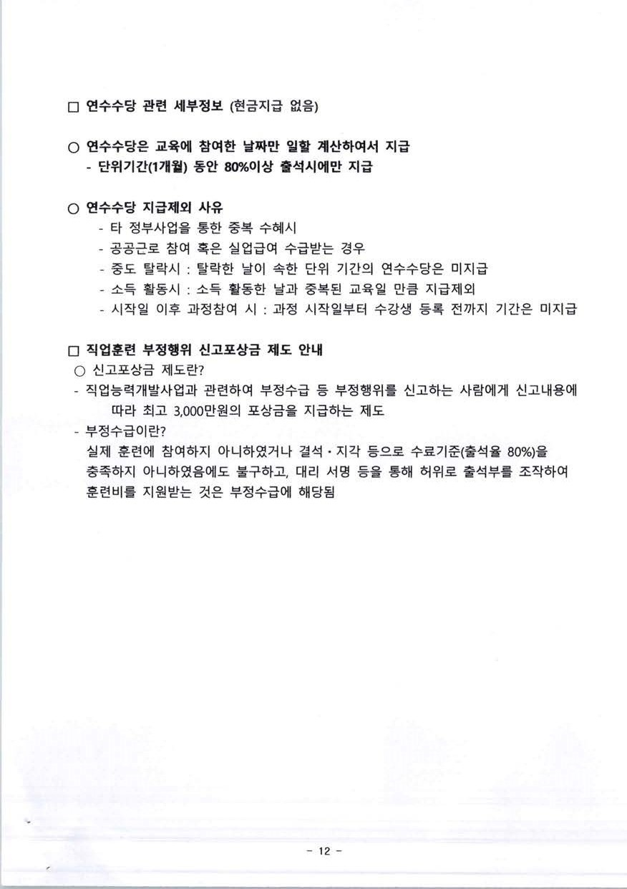
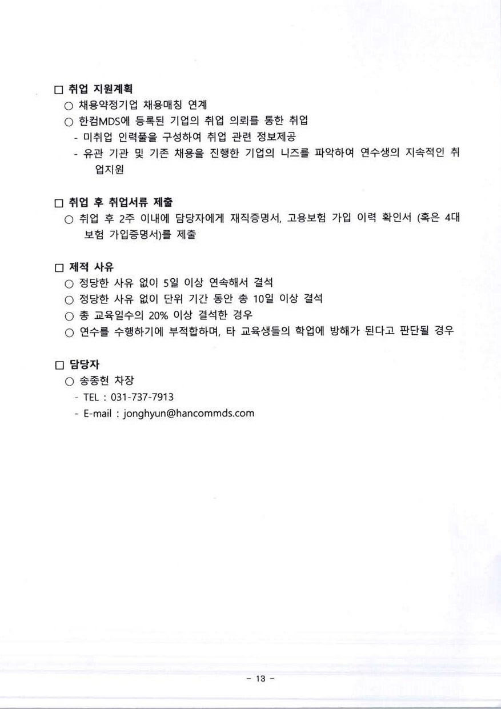
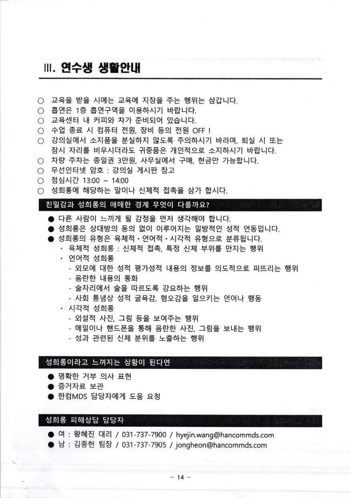

## 수료, 출석, 인원, 관련기관 정보
### 수료
* 수업시작 9시10분부터
* 이후는 지각
* 어플 비콘 100기준, 상황에 따라 봐줄 때도.
* 5월13일부터 11월1일까지 총 24주, 매주 40시간
* 총 교육비 개인당 1700만원
* 병가는 입원만
* 면접은 면접확인서(그날)

### 출입
* 교실 비번 \* 누르고 190513 \* 누르기
* 나갈 때 교실 문 닫고 0 누르면 교실 잠김

### 지급
* 현급지급 없이 카드 지급
* 80% 넘은 인원에 한에 지급

### 인원
* 총 25명
* 원래 반 2개 모집했는데 하나로 합쳐서 25명. 3기 현재 모집중

### 휴일이 있다면
그 주, 토요일 수업으로
* 6/06
* 8/15
* 추석은 그 주 다 쉬고

### 주식하는 사람 참고
* 한컴유니맥스
* 한컴텔라딘

### 관련기관
* honeywell lanner edivis inprontiv
* 정보통신기획평가원

### 협력기관
* 취업 알선

## 교육관련
### 장비제공
* nvidia 장비 주고 다룰 시간 준다. tx2
* drive tx2

### 교육16주 + 산학 8주
* 16주 교육 여기서
* 08주 산학 프로젝트 가는거나 오는거

### 산학 프로젝트
* 지난기수 acc 시뮬레이터 만듬
* abb ? 실무 프로젝트 개발.
* 자율주행 모형차 
* tx2보드 제비? 올리든 자율주행 시스템  세코닉스?가 좋다? 레오파드?
* 지난기수는 120도로 했다. 세코닉스는 190도?

---

# 멘토링 관련

주 1회 오프라인? 맨토가 와서 맨토링 오프라인 4시간. 대면맨토, 나머진 다 대면. 

우리 13주차부터 16주차 부터 강의. 금요일은 오프라인맨토, 오후 남는 시간에 혼자.팀별로.  13 14 15 16까지. 17차는 강의 없이 강사님 들어온다. 

장소 멘토가 지정한, 출석, 맨토가 지정한 출석 장소 기준으로. 16주까지 강의하고 맨토 병행. 17주차 출석

---

[다시 main 으로](../README.md)
