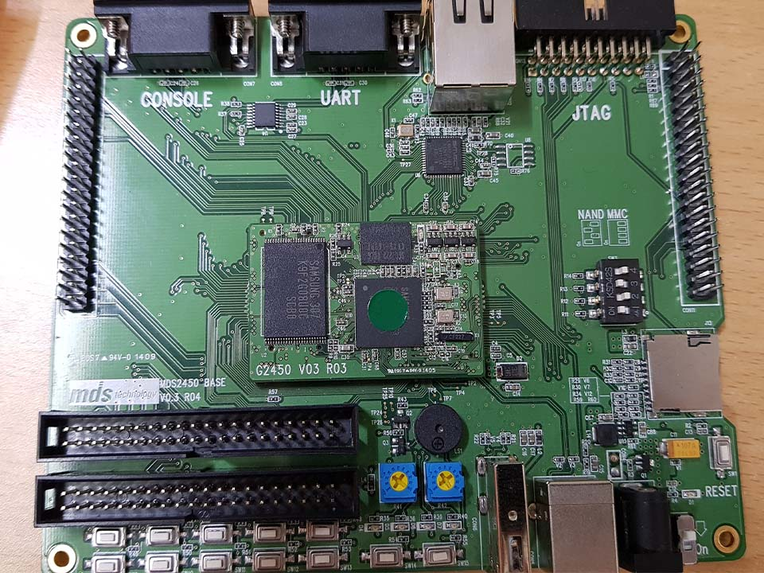

# Embedded C 수업

## intro

<!--  -->

* 김성영 강사님
* [참고까페 embeddedcrazyboys](https://cafe.naver.com/embeddedcrazyboys)

## 수업 진행 내용

|index||Link|list|etc|
|:---|:---|:---|:---|:---|
|Week 2 - Embedded C|Day 1|[L I N K](./w02_c/w02d01.md)|임베디드C, 개발환경구축
||Day 2|[L I N K](./w02_c/w02d02.md)|LED, Switch 제어
|||[L I N K](./w02_c/w02d02_switch_studying.md)|Switch 내용정리, 선생님 코멘트
|||[L I N K](./w02_c/w02d02_switch_studying2.md)|Switch 내 코드 주석|[경호](./w02_c/d03/Team_done/kh.c), [용준보경](./w02_c/d03/Team_done/ynb.c), [봉준](./w02_c/d03/Team_done/bj.c)
||Day 3|[L I N K](./w02_c/w02d03.md)|C언어 심화, Project ~Led, Key
||Day 4|[L I N K](./w02_c/w02d04.md)|C언어 심화, Project ~Timer0
||||내 Switch 코드 오류
||Day 5|[L I N K](./w02_c/w02d05.md)|Project 개념 정리|[동훈](https://github.com/Baccas-Kim/MDS_DHKim_Docs/blob/master/W2_MDS2450_review.md#3timer)
||Project|[L I N K](./w02_c/w02proj.md)|Project 타이머5개 with DMA

* 10년전 보드
* 삼성 S3C2450 칩셋
* MDS2450 개발보드 사용
* 우분투10.0(리눅스)로 포팅
  * 10년전 핫한 개발보드지만 카메라에 뭐에 뭐에 그래도 있을건 다 있다.!

LCD 걷어내면 이렇게 보인다.

---

[다시 # Home main 으로](../README.md)
