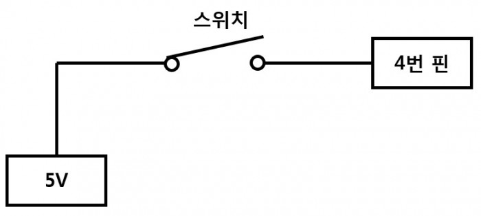
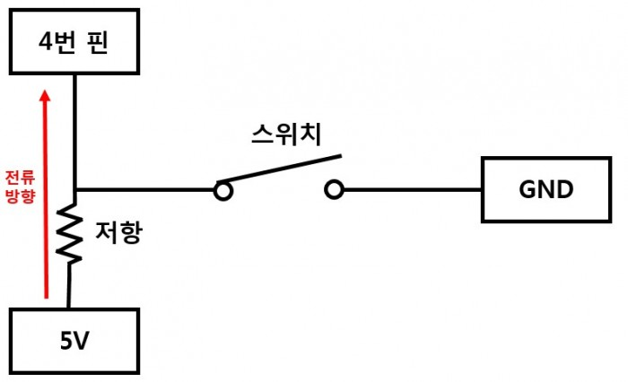
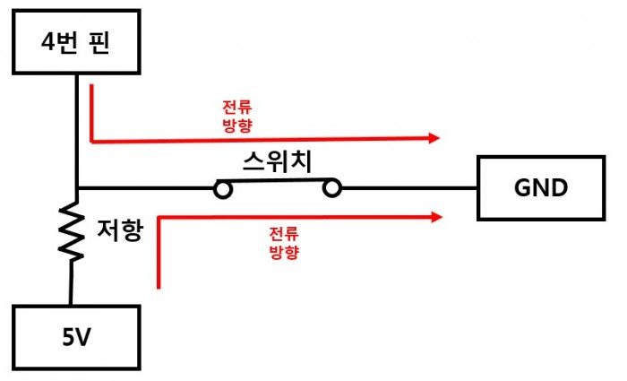
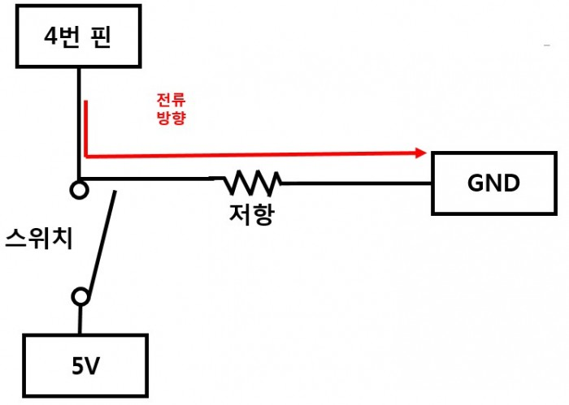
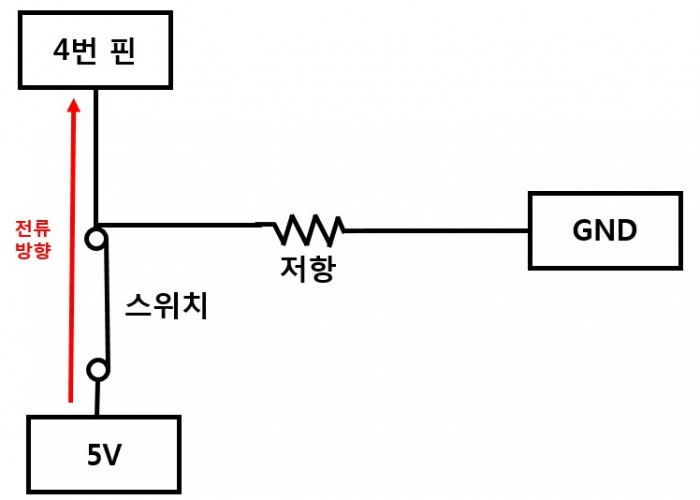
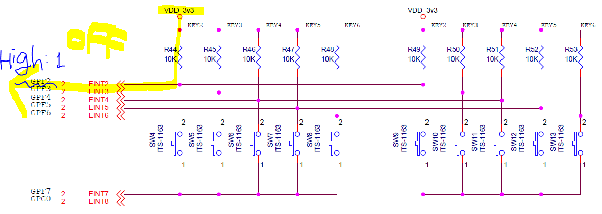
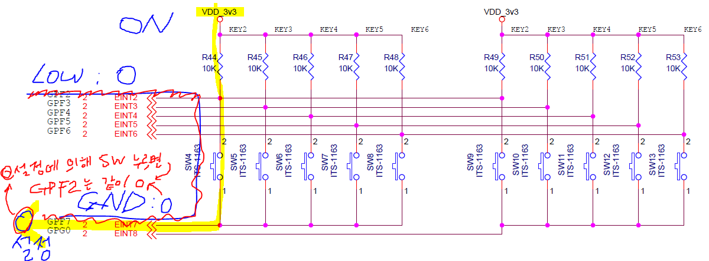
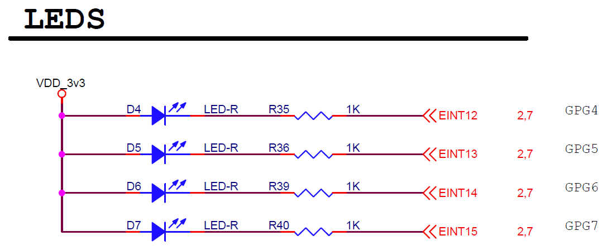

[참고 인터넷 블로그](https://kocoafab.cc/tutorial/view/526)

# 풀업과 풀다운

## 일반적인 연결   

>`5V` - `스위치` - `특정핀`



위와 같이 MCU 특정 핀에 스위치와 5V(VDD) 같은 전원을 연결 후 스위치를 닫으면(연결시키면) 특정핀에 `5V`, 그러니까 `1`이 흐르지만 스위치를 열면(연결을 해제) 다시 0으로 가는 것이 아니라 0과 1에서 방황하는 아무런 상태가 아닌, 부유하고 있는 상태, 플로팅 상태라고 한다. 저항이 없어서, 미세하게 작은 신호가 마구 흘러들어오거나 나갈 수 있는데 특정핀에 들어온 값이 0은 아닌 뭔가가 들어와 있다고 판단할 수가 있기 때문이다. 이런 일반적인 연결로는 스위치를 사용할 수 없다. 이런 문제를 해결하기 위해 풀업, 풀다운 연결 방식을 스위치에서는 사용한다. 

## 풀업과 풀다운

* 풀업, 플로팅 상태일 때 값을 끌어올린다는 말
* 풀다운, 플로팅 상태일 때 값을 끌어내린다는 말

|풀업||풀다운||
|:---:|:---:|:---:|:---:|
|ON|0(Low)|ON|1(High)|
|OFF|1(High)|OFF|0(Low)

## 풀업

>풀업저항, 풀업연결 (전원부에 저항 연결) 

### 스위치 열려있을 때



* VCC는 특정핀을 향해, 조금 더 높은 전압이 낮은 전압으로 흐르게 된다. 

<!-- |스위치 열려있을 떄|특정핀|교차점|GND|
|:---:|:---:|:---:|:---:|
|풀업저항|1|1|0| -->

### 스위치 닫혔었을 떄 (스위치 눌러서 연결 됐을 떄)

>풀업저항, 풀업연결 (전원부에 연결)  



* 플로팅되어 잔류되었던 특정핀은 GND로 스위치에 의해 바로 곧바로 연결되어 GND로 빠지고
* 5V전원도 저항을 타고 GND 로 흐른다.

<!-- |스위치 닫혀있을 때|특정핀|교차점|GND|
|:---:|:---:|:---:|:---:|
|풀업저항|1|1|0| -->

## 풀다운

>풀다운저항, 풀다운연결 (GND 쪽에 저항 연결)

### 스위치 열려있을 때



위의 그림과 같이 특정핀의 전류가 그대로 GND로 흐른다. 특정핀은 GND, 0

<!-- |스위치 열렸을 때|특정핀|교차점|GND|
|:---:|:---:|:---:|:---:|
|풀다운저항|0|0|0| -->


### 스위치 닫혔었을 떄 (스위치 눌러서 연결 됐을 떄)



5V의 전압이 스위치를 거쳐 그대로 특정핀에 흘러 1을 나타낸다. GND로는 저항에 의해 흐르지 못한다.

<!-- |스위치 닫혔을 때|특정핀|교차점|GND|
|:---:|:---:|:---:|:---:|
|풀다운저항|1|1|0| -->


***풀다운보다는 풀업이 노이즈나 충격에 훨씬 강하기에 풀업저항이 많이 사용된다***


# 회로분석

S3C2450 소자, mds2450 개발보드의 데이터시트를 보면 키배열이 아래와 같이 배치되어 있다.


스위치 안 눌렀을 때는 계속 1 



스위치 누르면 0 으로 바뀜!



`VDD` 전압은 10k 저항을 거쳐 스위치를 지나 `GPF7` 또는 `GPG0` 로 연결되어 있는데 

* 풀업저항으로 스위치 신호를 설정 후 확인하게 되면
  * `GPF7`, `GPG0`을 0으로 설정(output mode 신호 0)
    * `VDD`를 어딘가로 흐르게 해야하는데 이 두 곳을 0으로 설정해놓으면 눌러진 스위치에 따라 상단에 `VDD` 신호가  이곳으로 흐르면서 `GPF[2:6]` 이곳을 지나가는 신호 확인하면 된다.
  * 스위치를 누르기 전에는 `GPF[2:6]` 까지 모두 1
  * 스위치를 누르면 `GPF[2:6]` 중 관련된 스위치가 0
  * 이렇게 신호의 외부적 변화를 확인하기 위해선 input mode로 신호를 들어오게 한다.
    * 즉 SW4번을 누르면 SW4와 연결되어 있는 `GPF2` 가 1에서 0으로 바뀜. (0이 스위치 눌러진 상태)

***스위치를 누르면 0, 그렇지 않으면 1***


# C 코딩


## 개념정리

* 초기화
  * 사용하고자 하는 port를 초기화 해준다. 초기화는 혹시 모를 문제나 이전에 올라간 프로그램과 충돌을 대비해 다시 정리하고 간다는 느낌으로 이해한다.
* SW4번 하나를 제어하기 위해선 
  * `GPF7`엔 0으로 설정해 sw4 스위치를 눌렀을 때 전원이 흐르게 해주고 
  * `GPF2` 번으로 sw4 스위치 눌렀을 때 또는 안 눌렀을 때의 신호를 보게 된다.


10개의 스위치 모두 제어하기 위해 
* `GPF7`, `GPG0` 하단부 두 레지스터는 신호를 0으로 내보내는 output mode로 설정한다.
* `GPF7`
  * `GPFCON`, `0x56000050`
  * `GPF7 [15:14] 01 = Output`
    * port F를 제어하는 `GPFCON` 은 `0x56000050` 주소에 있고 그곳에 있는 `GPF7`번은 총 32bit 중 [15:14]번이다.
    * output 모드인 01로 바꿔주면서 0 이라는 GND 값을 내보내게 한다.
      ```
      GPFCON 0x56000050 R/W Configures the pins of port F 0x0
      GPFDAT 0x56000054 R/W The data register for port F 0x0
      GPFUDP 0x56000058 R/W Pull-up/down control register for port F 0x5555
      ```
* `GPG0`
* `GPGCON`, `0x56000060`
  * `GPG0 [1:0] 01 = Output`
    * port G를 제어하는 `GPGCON` 은 `0x56000060` 주소에 있고 그곳에 있는 `GPG0`번은 총 32bit 중 [1:0]번이다.
    * output 모드인 01로 바꿔주면서 0이라는 GND 값을 내보내게 한다.
      ```
      GPGCON 0x56000060 R/W Configures the pins of port G 0x0
      GPGDAT 0x56000064 R/W The data register for port G 0x0
      GPGUDP 0x56000068 R/W Pull-up/down control register for port G 0x55555555
      ```

## 코딩

* 	/* `GPFCON`, `GPGCON` - `output mode` `GPF7`, `GPG0` */

init 설정

```c
rGPFDAT &= ~(0x3f<<2);	  //GPFDAT[1:3] = 0, input mode
rGPFUDP &= ~(0x3ff <<4);  //GPFUDP[2:6] = pull up-down disable
rGPFUDP |= (0x2aa <<4);	  //GPFUDP[2:6] = pull up enable
rGPFCON &= ~(0x3ff <<4);  //GPFCON[2:6} = 0, input	
```

* 	/* `GPFCON` -`Input Mode` `GPF[2:6]` */

```c
rGPFDAT |= (0x1<<7);      //GPFDAT[3] = 10 ???????
rGPGDAT |= 0x1;           //GPGDAT[0] = 01 output mode

rGPFCON &= ~(0x3<<14);    //GPFCON[7] = 00 input
rGPGCON &= ~0x3;          //GPGCON[0] = 00 input
rGPFCON |= (0x1<<14);     //GPFCON[7] = 01 Output
rGPGCON |= 0x1;           //GPGCON[0] = 01 Output
```

버튼 누를때 확인

```c
rGPFDAT |= 0x1<<7;        //GPFDAT[3] = 10 ????
rGPGDAT |= 0x1<<0;        //GPGDAT[0] = 01
(i==1)?(rGPGDAT &= ~0x1):(rGPFDAT &= ~(0x1<<7));
                          //GPGDAT &= ~0x1)       //GPGDAT[0] AB 중 B만 0으로
                          //GPFDAT &= ~(0x1<<7)   //GPFDAT[3] AB 중 A만 0으로

keyval = (~(rGPFDAT>>2) & 0xF);
```

```c
rGPFDAT &= ~(0x3f<<2);    //GPFDAT[1:3] = 0, input mode
rGPFCON &= ~(0x3ff<<4);   //GPFCON[2:6} = 0, input	
```


# 선생님 스위치 설명

<스위치 작동원리>

스위치를 누르지 않은 상태일때는 스위치에 해당하는 핀의 전압이 VDD이므로 1(HIGH) 상태이다.

스위치를 누를경우 스위치에 해당하는 핀이 4~8번일경우 GPF7과, 9~13번일경우 GPG0 과 연결되는데,

GPF7, GPG0의 값이 0(LOW)이면, 연결된 핀의 전압이 0V가 되므로 0(LOW)상태가 된다.

GPFDAT7, GPGDAT0을 1(HIGH)상태로 둘경우 연결된 핀의 전압은 여전히 VDD이므로 핀의 상태는 HIGH(1)가 된다.


ex)
4번 스위치가 열린상태 : GPF2에 걸리는 전압이 VDD 이므로 1(HIGH)

4번스위치 닫힘, GPF7의 상태가 LOW : GPF2에 걸리는 전압이 0V 이므로 0(LOW)

4번스위치 닫힘, GPF7의 상태가 HIGH : GPF2에 걸리는 전압이 VDD 이므로 1(HIGH)


1. LED 설정

GPGCON4~GPGCON7 을 01(output mode) 로 초기화

GPGDAT의 4~7번 비트를 1(HIGH)로 초기화


2. keypad 설정

GPFCON2 ~ GPFCON6 을 00(input mode)로 초기화

GPFDAT의 2~6번 비트는 회로상 이미 1(HIGH)상태


GPFCON7, GPGCON0 을 01(output mode) 로 초기화

GPFDAT의 7번비트를 0으로 할 경우 4~8번 스위치가 작동

GPGDAT의 0번비트를 0으로 할 경우 9~13번 스위치가 작동


3. GPFDAT

회로상 GPFDAT의 2~6번비트는 기본상태가 1(HIGH)이다.

각 핀에 해당하는 스위치를 누를 경우 해당 비트가 0(LOW)가 된다.

ex)5번 스위치를 누를경우 GPFDAT의 3번비트만 0이 된다.


조건문을 통해 각 스위치에 맞게 LED를 설정한다.


---
[다시 # week 2 index 로](../w02.md)

[다시 # 전 과정 main 으로](../../README.md)


<!-- 
 -->

