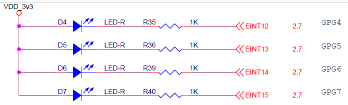

# LED

LED는 D4, D5, D6, D7 까지 총 4개가 있다.
* D4 - GPG4
* D5 - GPG5
* D6 - GPG6
* D7 - GPG7

원하는 LED를 0으로 만들어야 해당 LED가 켜진다.

GPGCON[4:7]은 

* GPGCON 0x56000060
* GPGCON[4:7] output mode 01 로 설정

GPGDAT[4:7]은

