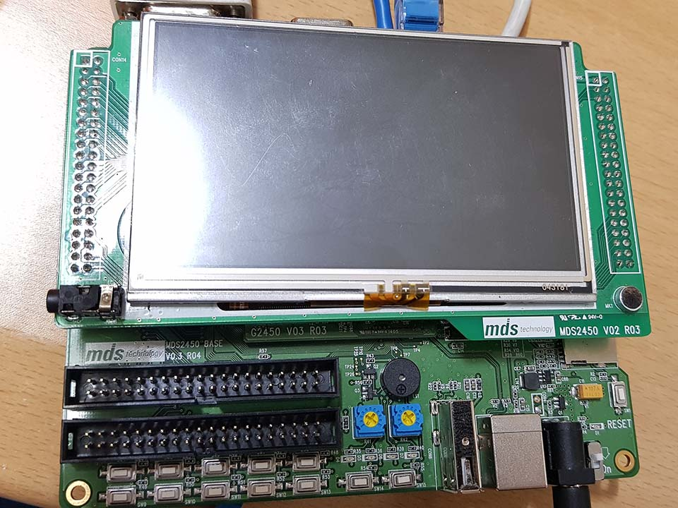

# Week 3 - C++

## intro
* 강의교재 
  * ***이것이 C++ 이다.***
* 
* 단 4일만에 C++ 한 바퀴..

## 

|index||Link|chapter|etc|
|:---|:---|:---|:---|:---|
|C++|Day 1|[L I N K](./w03_cpp/w03d01.md)|1, 2, 3
||Day 2|[L I N K](./w03_cpp/w03d02.md)|4, 5, 6
||Day 3|[L I N K](./w03_cpp/w03d03.md)|7, 8 
||Day 4|[L I N K](./w03_cpp/w03d04.md)|9,10 (11,12,13 pass)
||Day 5|[L I N K]
||Project|[L I N K]

<!--  -->

---

[# Home main](../README.md)

