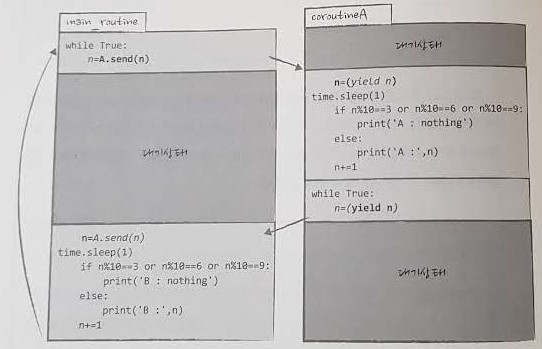

<!-- 
Python 관런 서적은 처음 가져본다. 온라인으로, 오픈소스로, 무료pdf 서적으로 혼자 코드를 뜯어보면서 공부했었는데 커리큘럼 상 단 4일짜리 파이썬 교육이 있고 무거운 책도 나눠주기에 다시 한번 정리하면서 곱씹어보려한다. 전반적으로 강사님도 내 스타일이 아니고(분명 좋으신 분이지만, 1주차 강사님처럼 수준별 강의와 프로젝트식 강의가 너무 좋았기에....) 책은 더더욱 아니지만(이 책은 파이썬으로 이런 것들 모두 할 수 있어~ 라는 걸 가볍게 보여주는 책이니..) 어쨌거나 저쨌거나 나는 파이썬이 그나마 제일 익숙(?) 하니 그럴지도 모르기도 하지만서도...

언젠가 내가 파이썬을 유튜브에 강의를 하게 되면 어떻게 할까를 예전에 공부하면서 많이 생각해 봤는데 그 첫 단락이 `왜 파이썬인가?` 였다. 근데 이번 강사님은 그게 전혀 없이 그냥 C와 C++을 비교한 수업을 진행하셨다. 물론 임베디드니 그럴 수 있지만 반대로 생각해보면 임베디드에서 파이썬을 배울 필요가 없는 것이 아닐까?  -->

`왜 파이썬인가?` 아니 `왜 임베디드에서도 파이썬인가?` 에 대한 물음에 해답은 들을 수 없었지만. 그거 찾으려고 이렇게 공부하는게 아닐까.  

# 책 정리

아래 내용은 책을 보면서 이것 만큼은 꼭 까먹지 말자 느낌으로 가볍게 옮겼다.

## 2장

* 리터럴 
  * 3, 3.14, "I Love python"
  * 변하지 않고 고정된 데이터 자체의 표현

## 3장

* C 정적 타이핑
* Python 은 동적 타이핑
* Python 은 변수에 데이터를 대입하면 변수가 데이터를 직접 참조하는 것이 아니다.
* Python 은 모든 데이터가 파이썬이 제공하는 특수한 형태의 객체로 둘러쌓여 있다.
  * 그래서 타입 선언 불필요(이미 정해져 있으니까)

### 객체
* 객체 내부로 접근하기 위해서 이 객체를 참조하는 변수를 통해서 접근해야 한다.
    ```python
    >>> spell_object.print_spell()
    Hello World
    ```
* 어트리뷰트(속성)과 메쏘드
  * 위에서 객체 내부의 데이터를 담은 변수 `spell_object` 가 객체
  * `spell = "Hello World"` 는 `Atribute` 속성
  * `print_spell()` 그 안에 있는 함수는 `메쏘드`
  * `.` 은 속성접근자

## 4장

* 4 built-in data type
  * number type
  * sequences type
  * set type
  * mappings type
* `is 연산` 과 `== 연산`
  * -5~256 까지의 숫자는 한번만 생성
  * 그 외의 숫자는 생성될 때마다 새롭게 생성
  * is는 id 값을 비교하는 연산
  * == 내부 값을 비교하는 연산
* *사칙연산시 낮은 자료형은 승격*
* 쉬프트연산 ***8421코드***

## 5장 

* 깊은 복사를 하는 이유는 동일한 데이터를 가진 객체를 새롭게 생성하기 위한 것
* 리스트`[]`와 튜플`()`
  * 튜플의 메모리가 더 적게 소모된다
  * 튜플은 수정이 불가하기 때문에 안정, 보안의 목적으로 사용된다.
    ```python
    >>>'python' in s
    false
    ```
* `eval()` 문자열 연산처리
* `capitalize()` 첫문자 대문자
* `casefold()` 소문자, 문자열비교
* `insert(index, object)`
* `pop()` 내용 지우면서 출력
* `deepcopy()`
* `copy()`
* 튜플
  * `mytuple=()`    # 이렇게 하면 연산자
  * `mytuple=(1,)`  # 이렇게 해야 튜플 가능
  * `from collections import namedtuple`

## 6장

* 4 built-in data type
  * mappings type

Dictionary

* `update`
* `setdefault`
* key 존재 여부 확인
    ```python
        dict_test = {'first':7, 'second':77, 'third':777}
        x = {'first':0, 'end':100}      # 추가하려는 사전

        for my_key in x:
            if my_key not in dict_test:
                dict_test.update({my_key:x[my_key]})
    ```
* 항목삭제 
  * list나 dict 은 del 연산자 사용    

변환
* dictionary에서
  * 튜플로
    * `.items()` 리스트 형식으로 변환
  * 리스트로
    * `list()` 타입변환 사용
* 튜플에서
  * dictionary로
    * `dict()` 타입변환 사용

***`.items()`메소드의 호출 결과로 반환되는 `view object` 는 사전의 내용이 바뀌면 그 영향을 받게 된다.***
* `view object`는 
  * 사전의 항목의 개수를 알 수 있다.
  * iter 함수를 이용하여 사전의 항목에 대한 반복자를 얻을 수 있다. 

## 7장

* key 는 hashable 객체, 변경 불가여야 한다.
* set 의 항목은 hashable 객체, 변경 불가여야 한다.
* set 타입 객체로 집합을 표현하여 연산 수행
    ```python
    >>> A = {1,2,3,4,5}
    >>> B = {4,5,6,7,8,9}
    >>> A|B             # 합집합
    {1,2,3,4,5,6,7,8,9}
    >>> A&B             # 교집합
    {4,5}
    >>> A-B             # 차집합
    {1,2,3}
    >>> B-A             # 차집합
    {8,9,6,7}
    >>> A^B             # 교집합의 여집합
    {1,2,3,6,7,8,9}
    ```
* set 항목 추가
    ```python
    >>> A = {1,2,3,4,5}
    >>> A.add(7)             # add() method    
    >>> A.add(6)
    >>> A.union([44,55,99])  # union() method 
    ```
  * union method 는 iterable 객체를 인수로 받는다. (반복가능한 객체)
* 항목삭제
  * del Operator(연산자) 불가
    ```python
    >>> A = {1,2,3,4,5}
    >>> A.remove(4)
    >>> print(A)
    {1,2,3,5}
    >>> A.remove(4)
    Traceback (~!@~!~@) # 오류 발생!!!!!!!!!!
    ```
    * remove(object) method는 object(객체)와 동일한 값을 지닌 항목을 삭제
    * 만약에 없으면 오류 발생
    ```python
    >>> A = {1,2,3,4,5}
    >>> A.discard(4)
    >>> print(A)
    {1,2,3,5}
    >>> A.discard(4)
    {1,2,3,5}           # 아무일도 일어나지 않는다.
    ```
    * discard(object) method 는 없어도 아무런 오류가 발생하지 않는다.
  * 이렇게 두개다 다른 이유는 오류를 발생해서 수행동작을 가시적으로 만들 필요가 있기 때문\
* 항목존재
    ```python
    >>> 1 in {1,2,3,4}
    True
    >>> 5 in {1,2,3,4}
    False
    ```
* set을 list로
  * `sorted(A)`
    * sorted 함수는 iteravle 객체를 정렬하여 리스트로 반환
  * 직접타입변환
    * `set(A)`을 `list(A)` 로 바꾸고
    * 그걸 `A.sort()` 정렬하는 방법
  * 속도는 둘다 비스므리
* list를 set으로
  * 직접타입변환
    * `set()`으로 변환하면 순서가 바뀔 수 있다는 것을 명시
    * `list(A)`를 `set(A)`으로
      * 이러면 중복사라지고(set이니까)
    * 그걸 다시 `list(A)`로
    * 그 리스트를 다시 `A.sort()`
* `None` 
  * `[]` 빈 list
  * `{}` 빈 dictionary
  * 둘다 타입이 달라 비었어도 같지 않다. 그럴땐 `None`으로!
  * 어떤 의미 있는 행동을 하는 객체라기보다는 일종의 약속
    * 값이 없다는 약속
    * C 의 `null`

## 8장 제어문

### 조건문
* C conditional expression (조건 표현식)
  * `x > y ? x: y;`
  * x > y 조건에 따라 참이면 x 아니면 y
* python conditional expression
  * `A if statement else B`
  * if statement 가 참이면 A 아니면 B
* 중첩된 조건표현식
  * `A if statement else (B if statement else C)` 이런 식으로 하나 더 들어가는.
    * `A if statement else B if statement else C`
  ```python
  button = 2
  print("button1") if button == 1 else print("button2") if button == 2 else print("other button")
  button2
  ```
### for

* `for i in [0,1,2,3,4,5,6,7,8,9]:`
* `for i in range(0,10):`
* `for i in "python":`
* `for i in ('a', 'b', 'c', 1, 2, 3):`
* `for i in my_dict:` # 딕셔너리에서 키만나오고
* `for i in my_dict.values():`  # 이렇게 하면 values
* `for i in my_dict.items():`  # 이건 리스트 형식으로 둘 다 나오는

#### list comprehension 리스트 내포

리스트를 생성하는 새로운 문법

* `[expr for x in 반복가능객체]`
  * `[x for x in range(1, 10)]`

#### 리스트 내포 확장

리스트 내포에 if 추가

* `[expr (for x in 반복가능객체 if 조건식) (for x in 반복가능객체 if 조건식)]` 이렇게 이어서
  * `[expr for x in 반복가능객체 if 조건식 for x in 반복가능객체 if 조건식]`  
  * `[(x, y) for x in range(1, 10) for y in range(1, 10)]`
  * `(x, y)` 이건 표현식으로 튜플 타입 항목 표현

#### 중첩 리스트 내포

* `[expr for x in 반복가능객체 if 조건식]`
  * `[x for x in range(1, 10) if x%2==0]`
  * `['짝' if x%2==0 else '홀' for x in info]`

### while

* iterable 객체 필요
* 반복자 `iter()`함수로 `list()`를 iterable 객체로 만들면 while 도 반복 가능 
  * 내부 메쏘드 `__next__()` 사용
  ```python
  my_list=[1,2,3,4,5]
  it = iter(my_list)
  while it:
      print(it.__next__())
  ```
* 요 위 코드를 보면 for 문은 반복 가능한 객체에 특화된 형태의 제어문

### 기타문법

리스트 내포 처럼, 셋내포 튜플내포 만들기

  ```python
  set_comp = {x for x in range(1, 10)}
  {1.2.3.4.5.6.7.8.9}

  dict_comp = {x: x**2 for x in range(1, 10)}
  {1:1, 2:4, 3:9, 4:16, 5:25, 6:36, 7:49, 8:64, 9:81}
  
  tuple_comp = (x for x in range(1,10))
  <generator object> ~~   # 제네레이터 객체 생성
  ```

## 9장 함수

```python
def function(x, y):     # x, y 이게 Parameter 형식인수
    print(x+y)

>>> a=1
>>> function(a, 2)      # a, 2 이게 Argument 실인수
3
``` 
* 인수
  * Parameter
  * Argument

### 인수의 전달방식

인수의 전달방식에 위치인수, 키워드인수, 기본값을 가진 형식인수 등이 있는데 그중에 가변인수를 받는 형식인수에 대한 설명 왜냐? 가장 자주 쓰이니까

* 위치인수는 알규먼트 순서에 따라 전달되는 거고
* 키워드 인수는 알규먼트 이름에 맞춰서 전달
* 기본값은 알규먼트 기본값이 있어서 인수 없으면 기본값으로 전달되는 것이고
  * 단 함수의 인수 정의순서 꼭 지키기
  * 기본값이 있다면 오른쪽으로 밀고
  * 가변인수가 있다면 마찬가지로 오른쪽으로 밀고
    * 왜냐면 가변인수가 몽땅 잡아먹을 수 있으니까

#### 가변인수를 받는 형식인수

* `variable argument` 가변 인수
* `*`를 붙이면 외부에서 전달받은 데이터를 튜플 타입으로 저장
* `**`를 붙이면 사전타입으로 저장
* (키=값)의 형태로 인수 전달
  ```python
  def function(*args):                    # args 는 튜플 형태

  >>> function(1,2,(3,4,5))               # 인수 3개 전달
  ``` 
  ```python
  def function(**args):                   # args 는 딕셔너리 형태

  >>> function(a=1, b=2, c=3)             # 키워드 인수형태 전달

  >>> function(**{'a':1, 'b':2, 'c':3})   # 키워드 사전형태 전달
  ``` 
  ```python
  def function(a, *args, **dicts):        # 순서는 꼭 이렇게
  ``` 


## 리턴

파이썬에서는 리턴값 여러개 가능

`return x,y,z`

## 영역과 이름공간

* `global scope`, `local scope`
* `namespace`
* 지역영역에서 정의된 지역변수(`local variable`)는 지역 이름공간에 저장
* 전역영역에서 정의된 전역변수(`global variable`)는 전역 이름공간에 저장
* `local()`, `dir`, `globals` 함수로 이름공간 확인
  * `dir(__builtins__)` 이렇게 내부 변수 정의 확인도 가능
  * `local()['myvar']=100`  이렇게 직접 정의 가능
* 내장함수들의 내장영역 built-in scope  (LGB 영역들, 로컬, 글로벌, 빌트인)
* `global` vs `nonlocal` 함수에서 외부변수 사용하기 위한 키워드들
  * `global` 현 스코프 위치에서 전역으로
  * `nonlocal` 현 스코프 위치에서 한 껍질 밖 지역으로
* ***외부변수를 변경시키고자 할 때 global 선언 대신 list(참조)에 담아서 함수를 전달!***

람다표현식 안에는 반복문, 조건문, 제어문 있으면 안되는 그냥 표현식만

* `lambda 인수: 표현식`
  ```python
  >>> (lambda x: x**2)(3)
  9

  >>> lambda_func = lambda x: x**2
  >>> lambda_func(3)
  9

  >>> lambda_func = [lambda x: x**2, lambda x: x*2]
  >>> lambda_func[0](5)
  25      # 갓민 덕에 이 문제 맞춤
  ```
* 람다표현식을 콜백함수로 사용
  * `mylist.sort(key=lambda x:x)` 정렬
  * `mylist.sort(key=lambda x:-x)` 거꾸로 정렬
  * `mylist.sort(key=lambda x:x%3)` 
  * `mylist.sort(key=lambda x:x%2)`
  * option으로 전달된 값이 0이면 string을 소문자로 아니면 대문자로 바꾸는 함수를 콜백으로 바꾸고자 할 때
    * 일반함수에선
    ```python
    def funnc(string, option=0):
        if option:
            s = string.upper()
            print(s)
        else:
            s = string.lower()
            print(s)
    ```
    * 람다표현식으론
    ```python
    def funnc(string, option=0):
        print(option and (lambda s:s.upper())(string) or (lambda s:s.lower())(string))
    ```
* `pass`

### closer 클로저
  * 외부에서 함수를 불러드리면 그 함수는 자신이 정의된 환경에 대한 정보까지 같이 묶여서 불러들여지는 것을 `클로저`
  * 여러 클로저로 묶었을 떄, 함수는 동일하지만 함수의 지역이름공간(inner 함수의 외부영역)이 서로 달라지게 되고
  * 클러저로 묶어서 반환된 함수의 지역변수는 그 함수가 종료되어도 소멸되지 않고 있다는 것
  ```
  함수가 종료되면 메모리에서 소멸되는 걸로 알고 있는데 소멸되지 않고 있다 라? 
  아하 전체 프로그램이 종료된게 아니니까 그 내부 메모리는 살아서 가지고 있는 그런 느낌으로 이해해야겠군
  음... 그럼 클로저는 오브젝트랑 같은 개념인건가?
  ```

  ```python
  var = 0
  def outter():
      var = 77            # 이게 nonlocal로 78로바뀌고 유지
      def inner():
          nonlocal var
          var += 1
          print(var)
      return inner
  
  clsr1 = outter()         # 클로져1
  clsr2 = outter()         # 클로져2

  >>> clsr1()
  78        

  >>> clsr1()
  79                      # 바뀐 nonlocal 에서 1 증가 79

  >>> clsr2()
  78        

  >>> clsr2()
  79         
  ```

### decorator 장식자

함수마다 코드가 중복되는것이 꺼려진다면 장식자로!

* 장식자는 기능을 축가할 함수를 인수로 받는다
* 장식자의 내부에 추가될 기능을 함수로 정의
* 인수로 받은 함수를 내부에 정의된 함수에서 적절히 호출
* 내부 함수를 반호나, 이는 클로저로써 새로운 함수로 탄생

***클로저의 이해가 있어야 장식자도 이해 가능!!***


```python
import datetime

def deco1(func):          # func 꼭 써야함
    def new_func():
        print('Today', datetime.date.today())
        func()            # 여기도 ! 꼭 써야함
    return new_func

def deco2(func):
    def new_func():
        print('python ver 3.5.1')
        func()
    return new_func

@deco1                    # deco1(print_hi) 이렇게 들어가는거니까
def print_hi():           # 상단에 func를 써야하는 이유
    print("hello python")

@deco1                    # deco1(print_easy)
def print_easy():         # print_easy라는 내부함수 환경을 고스란히 받는
    print("python is easy")     # 클로저!

print_hi()
# Today 2019-06-09
# hello python

print_easy()
# Today 2019-06-09
# python is easy  
```
위에까지 내용 장식자는 아래 클로져의 개념 확장
```python
print_hi1 = deco1(print(print_hi))
print_hi1()
# Today 2019-06-09
# hello python
```
위에 클로져를 더 쉽게 하기 위해 장식자로 @deco1 이렇게 사용한 것


동시에 2개도 가능!
```python
@deco1
@deco2
def print_hi():
    print("hello python")

# Today 2019-06-09
# python ver 3.5.1
# hello python
```

#### 장식자에 인수 있을 때

```python
import datetime

def deco(func):
    def new_func(name, age):
        print('Today', datetime.date.today())
        func(name, age)
    return new_func

@deco
def print_hi(name, age):
    print("이름: ", name, "나이: ", age)
```
```python
# 장식자로 출력할 떄
print_hi('철수', 19)
# Today 2019-06-09
# 이름:  철수 나이:  19
```
```python
# 클로져로 장식자 문법 안쓰고 출력할 때
>>> print_hi1 = deco(print_hi)
>>> print_hi1('철수', 19)
# Today 2019-06-09
# 이름:  철수 나이:  19
```
이렇게 되면 일일이 내부함수를 수정해야하니까 가변인수 `*args`, `**kargs` 사용하면 더 아트해진다!

```python
def deco(func):
      def new_func(*args, **kargs):
          print('Today', datetime.date.today())
          func(*args, **kargs)
      return new_func
```

### 제네레이터 함수

* 반복가능 객체, iterable 객체, 리스트, 튜플, 문자열, 사전 셋타입 등

```python
>>> a = [1,2,3,4,5]
>>> it = iter(a)      #  반복자 iterator it 생성
>>> it.__next__()
1
>>> it.__next__()
2
>>> it.__next__()
3
```

제네레이터 `generator`는 `iterator`와 비슷하다. 
* 제네레이터는 함수를 통해 만들어지는데 
* 제너레이터를 만드는 함수는 함수 내에 `yield` 라는 키워드가 있는 함수다.
* 함수 내부에 `yield`라는 키워드가 사용되면 이 함수는 제너레이터 함수가 되고
* 이 함수를 실행하면 제너레이터 객체를 반환하는 반복자처럼 `__next__` 메소드를 가지고 있는, 호출될 때마다 제너레이터 함수 코드 실행

말이 복잡? 해보이지만 단순히 말하면

for while은 조건이라는 제약안에 계속 반복하면서 조건맞지 않으면 나오게 되는데, 이 반복자는 우리가 수동으로 호출하면서 한 단, 한 단 반복시킬 수 있는 함수라고 말할 수 있다.
* yield 는 값을 반환하지만 종료시키지 않고 함수 실행이 멈춘, 
* 그러니까 1에서 2로 반복이 되었는데, 계속 안가고 멈춰있는, 종료되어있지 않은 상태
* 다시 `__next__` 메소드가 나오면 2에서 3으로 넘어가고 다시 멈춰있는, 

```python
def my_gen():
    n = 0
    while n <= 10:
        yield n       # yield 등장
        n += 1

>>> a = my_gen()
>>> type(a)
<class 'generator'>

>>> a.__next__()      # next(a)와 같다
0
>>> a.__next__()
1
>>> a.__next__()
2
```

* 제너레이터는 __next__, __iter__ 메소드를 가지고 있는, 반복자 프로토콜을 만족.
* 반복자 프로토콜이란 반복자가 되기 위한 조건.
* 함수를 통해서 생성된 반복자를 특별히 제너레이터라고 부른다..


### co-routine 코루틴 함수


# asfasf
## asfasf
### afasf
##### asfasfasf
* fasfjaskfjklfjkaslfjaskll
* fjasklfjafjas
* afjklas


* 위에서 한 `yield` 도 코루틴 개념으로 대기상태 존재. 
* ***값을 반환했는데도 함수가 종료되지 않고 대기중인 상태***
* 코루틴은 제너레이터 일종이지만 보다 특수
* 그래서 제너레이터 객체와 코루틴 함수가 반환하는 코루틴 객체는 차이점 있다

제너레이터 객체는
* `__next__` 메소드를 여러번 호출하지만

코루린 객체는 
* `__next__` 메소드를 처음 한번만 실행
* 그 다음 `send() 메소드` 사용
  * `(yield)`문 전까지만 코드가 실행되기 때문, 
    * `(yield)`는 외부로부터 데이터를 전달받는 표현식의 의미 추가
  * 그 다음에 send 메소드를 호출할 때 데이터를 전달하면 
  * (yield)표현식은 전달된 데이터를 의미 따라서 지역변수 n에 다시 데이터가 전달되는 것.

```python
def co_routine():
    total = 0
    while True:
        n = (yield)     # (yield)표현식, send 메소드로 값을 전달 받는다.
        total += n
        print('total =', total)

>>> a = co_routine()
>>> a.__next__()
>>> a.send(1)           # send() 메소드 등장
total = 1
>>> a.send(1)
total = 2
>>> a.send(3)
total = 5
```

아래처럼 쓰면 외부로부터 데이터를 입력받고 반환하는 기능 두 가지를 모두 가진다.

```python
def co_routine():
    total = 0
    while True:
        n = (yield total)
        total += n

>>> a = co_routine()
>>> a.__next__()
0                     # 여기도 반환 0 나옴
>>> a.send(10)        
10
>>> a.send(3)
13
>>> a.send(8)
21
```

서로 동등하게 주고 받고 있는 루틴.
```python
import time

def coroutineA():
    n=0
    while True:
        n=(yield n)
        time.sleep(1)
        if n%10 == 3 or n%10 == 6 or n%10 == 9:
            print("A : noting")
        else:
            print("A : ",n)
        n +=1

n=0
A=coroutineA()
A.__next__()

while True:
    n = A.send(n)
    time.sleep(1)
    if n%10 == 3 or n%10 == 6 or n%10 == 9:
        print("B : noting")
    else:
        print("B : ",n)
    n +=1 
```




<!-- 
## 10장 모듈과패키지         # 다시 읽어보고 (실습 다시 해보고)
## 11장 클래스 370p 클래스 매쏘드, 스테틱 메쏘드 확인      11장만 다시 정독 필요
## 12장 파일다루기           # 다시 읽어보고
## 13장 예외                # 가볍게 봤고
## 14장 GUI                 # 나중
## 15장 멀티쓰레드 프로그래밍 # 나중
## 16장 네트워크 프로그래밍  # 나중
## 17장 데이터베이스        # 나중
## 18장 주요 표준 라이브러리 # 가볍게 봤고
-->


---

[다시 # week 4 index 로](../w04.md)

[다시 # 전 과정 main 으로](../../README.md)
