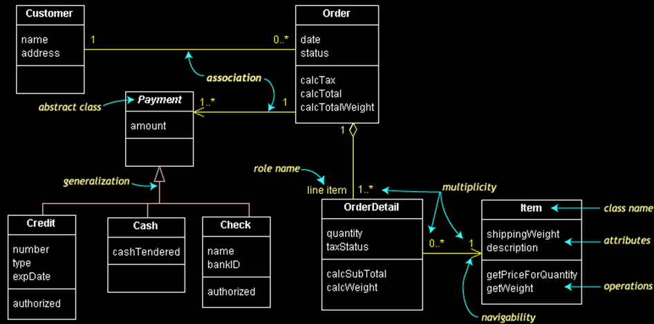
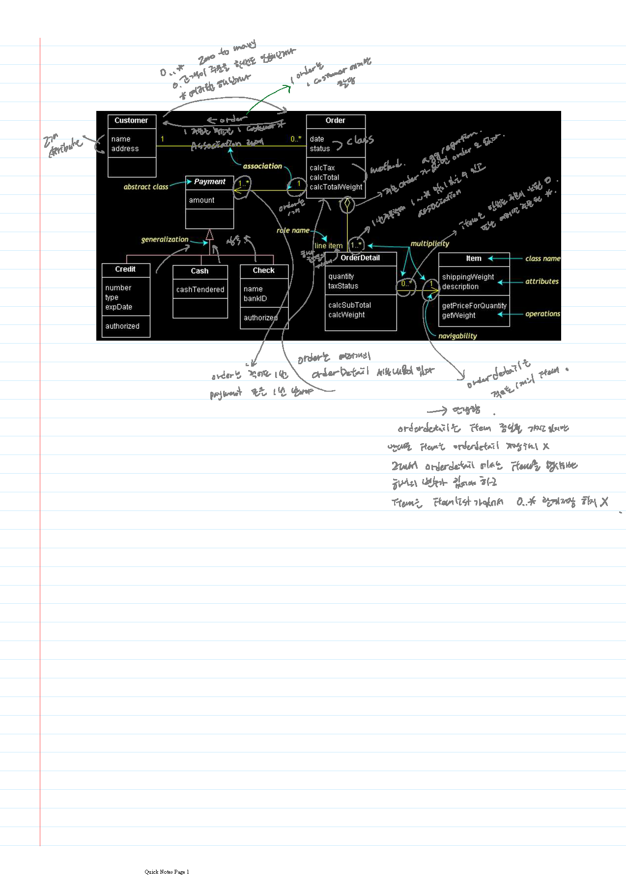

Linear Structure and Dynamic Programming


class Room(object):

설계할 때
@abstractmethod


constructor


Duck Typing

Easier to Ask for Forgiveness then Permission (EAFP)


Visibility options 인캡슐레이션
`+ -> public`
`# -> protected`
`- -> private`


Methods
`+-#(name)(arguments):(type)`

오버라이드 오버로드


generalization  상속  

association

aggregation

이러한 관계를 찾아서 읽고 구현


### generalization

* is-a relationship
* Inheritance relationship
* Hollow triangle shape 아래 -|> 위


```
Generalization between classes
is-a relationship
Inheritance relationship
Customer  Person
From subclass
To superclass
Direction of generalization
Hollow triangle shape
Base class
Person
Leaf class
Park::Customer…
```


### Association

* has-a relationship
* ***Multiplicity*** 여러개 붙일 수 있다.

```
Association between classes
has-a relationship
Member variables
A customer has a number of holding accounts
An account has an account holder customer
Simple line
If a simple arrow is added
A customer has a reference to bank accounts
A bank account has a reference to a customer
Navigability
Line ends are tagged by roles
Account holder
Holding accounts
With prefix showing the visibiliy
+: public , -: private, #: protected
```


Multiplicity of Association


```
In computer science and engineering
* often means many
Hence,
1..*
1 to Many
*
0 to Many
Naturally
1
Exactly one
0..1
One or zero
If not specified, it means one
```

### Aggregation

Association 비슷하지만 다른

Family  FamilyMember   FamilyMember가 없으면 Family도 없다. 의존적

```
Special case of association
Special has-a relationship
More like, part-whole or part-of relationship
A family member is a part of a family
The existence of the family depends on the aggregation of the family member
If nothing to aggregate, there is no family
Hollow diamond shape
Aggregation often occur 
when an aggregating class is a collection class
When the collection class’s life cycle depends on the collected classes
```

### Dependency 

* use relationship
지역변수, 활용하고 사라질 때. 

```
Dependency between classes
use relationship
An engineer uses a calculator
May use for
Local variables
Method signatures
Parameter types
Method return types
Something that you import for the implementation
```







## Weekly Objectives


* This week, we learn the first set of data structures: linked list, stack, and queue.
* Objectives are
  * Understanding the definition of abstract data types
  * Firmly understanding how references work
  * Understanding various linked list, stack, and queue structures
    * Singly linked list, doubly linked list, circular linked list…
    * Able to implement a stack and a queue with a list
  * Understanding the procedures of linked list, stack, and queue management
    * Insert, delete, search…
    * Should be able to estimate the number of steps for inserts, deletes, and searches

data structures: linked list, stack, and queue. 연관있는 3가지 선형적인 모습 가지고 있는

## Array for List

