***4주차 4일짜 20190607 수업***

***20190607 마지막 업데이트***

# Week 4 - Day 4 - Python

오늘부터 class, 저번시간 잠깐 class 언급. 

>351p

* 캡슐화
* 은닉
* 구조체, 퍼블릭속성, 외부접근 가능, 이사람 저사람 건들 수 있다?
* 오버라이딩 상속 부모꺼를 다시 재정의 
* 오버로딩 

객체화 할 수 없는 추상클래스? 최상위? 함수의 저의가 없다? 순수 가상함수? `=0` 추상 클래스, 정의가 없어서 단 오로지 상속용도. 이게 추상클래스. 보통 상속용으로 사용. 그래서 `virtual` 왜 `virtual`?? *참조 라는 말이 나와야 한다.* 특정객체를 포인터개념으로 접근했을 때 자료형이 부모형 맴버함수로 호출? 재정의로 ? `virtual` ***객체맴버함수를 포인터로 접근할 때, `virtual`*** 가상이면서 밑으로 내리는 것이 아니라, 그 함수로 동작하는 그 기능 순수 가상함수 하나라도 포함하면 추상클래스, 객체화 할 수 없다. 함수 정의가 없다. 

파이썬 플렛폼에 종속되지 않는다? 왜 파이썬? 언어 구현 쉽다. 생산성이 쉽다. 포인터가 없어서 빨리 아웃풋을 낼 수 있다.

**메모리 해제** python 참조카운팅 방법

C,C++,java 가비지 컬렉션
new, del

c stl 링크드리스트? 모두 다 동적할당 다 해줘야한다. c++ 리스트클래스 맴버함수만 쓰면 된다. c++ 객체접근 제한 퍼블릭, 프라이빅.

파이선은 모든게 퍼블릭. 그래서 씨플의 클래스와 파이썬의 클래스가 다르다. 씨플은 기본 맴버 설정이 프라이빗, 다 퍼블릭, 정보은닉 개념에선.....?

>여기까지 다시 정리 필요


## Class

>제대로 class 수업 시작 2교시부터

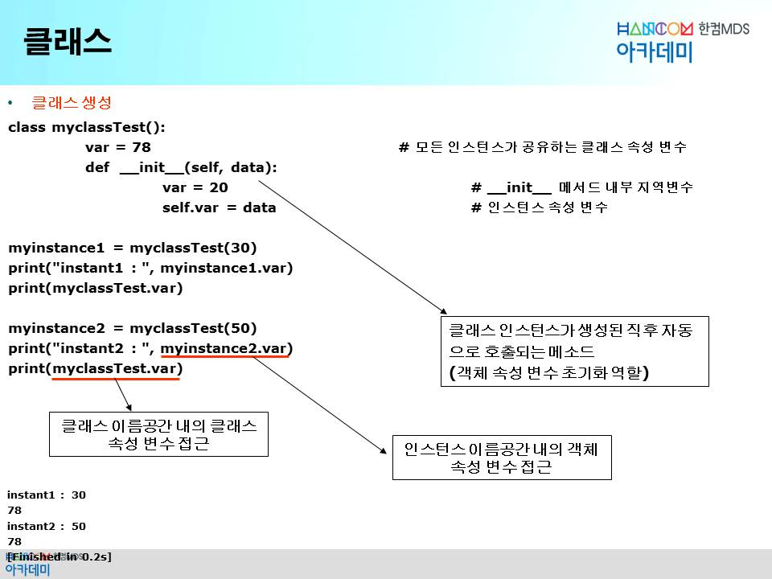

* `clss myclassTest:` 첫 줄 괄호 없어도 된다. 상속 받을 때 괄호 사용
* c++ 에서 맴버함수를 호출하는게 누구냐? 내부적으로 `this point`
  * `self`
* 인스턴스 소속이냐 클래스 소속이냐

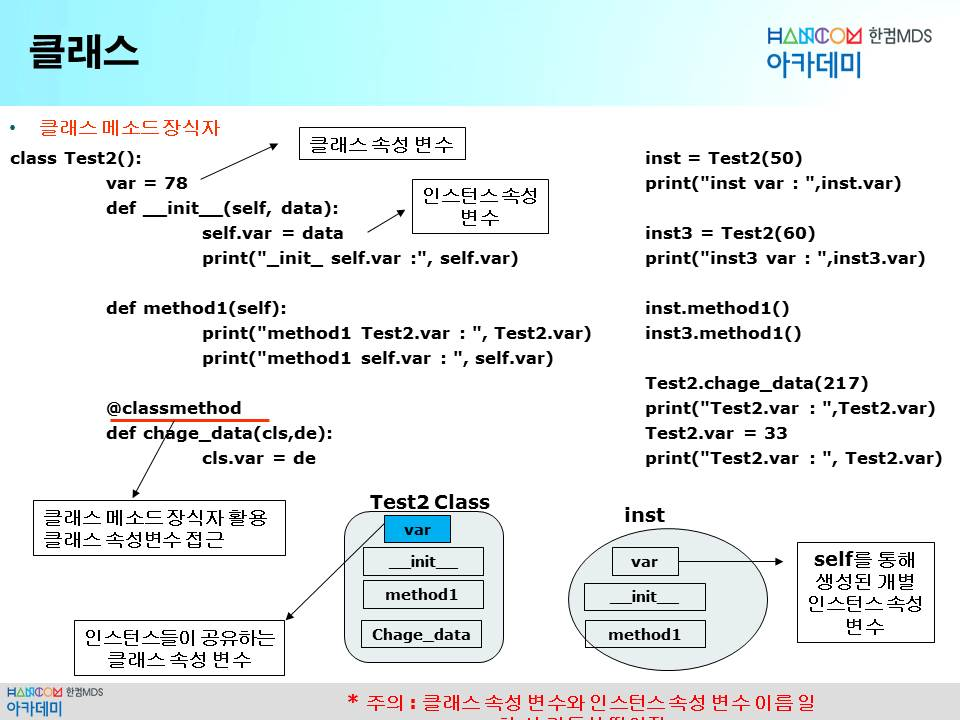

```python
class myclassTest():
    var = 78                    # 전역 변수
    def __init__(self, tm):
        var = 20                # 지역변수
        self.mvar = tm          # 인스턴스 속성변수
    def show_date(self):
        self.mvar = 33          
        print("self.mvar : ", self.mvar)

mytest = myclassTest(30)

# myinstance1 = myclassTest(30)
# print("instant1: ", myinstance1.var)
# print(myclassTest.var)

# print(dir(mytest))
# print("\n")
# print(dir(myclassTest))
# print("\n")
mytest.modify = 88              # 외부에서 맴버 선언
print(dir(mytest))
```


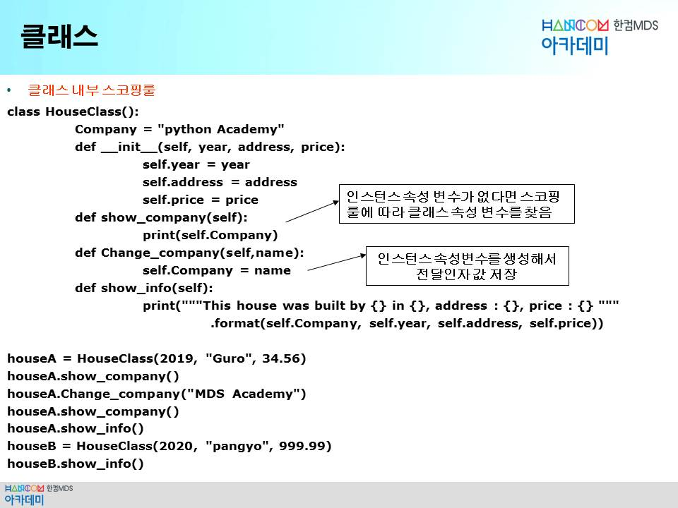

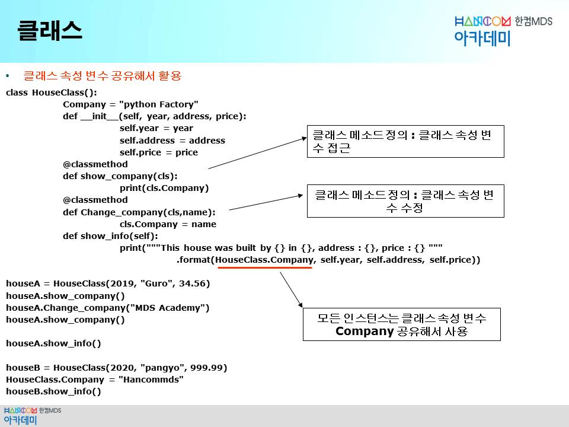

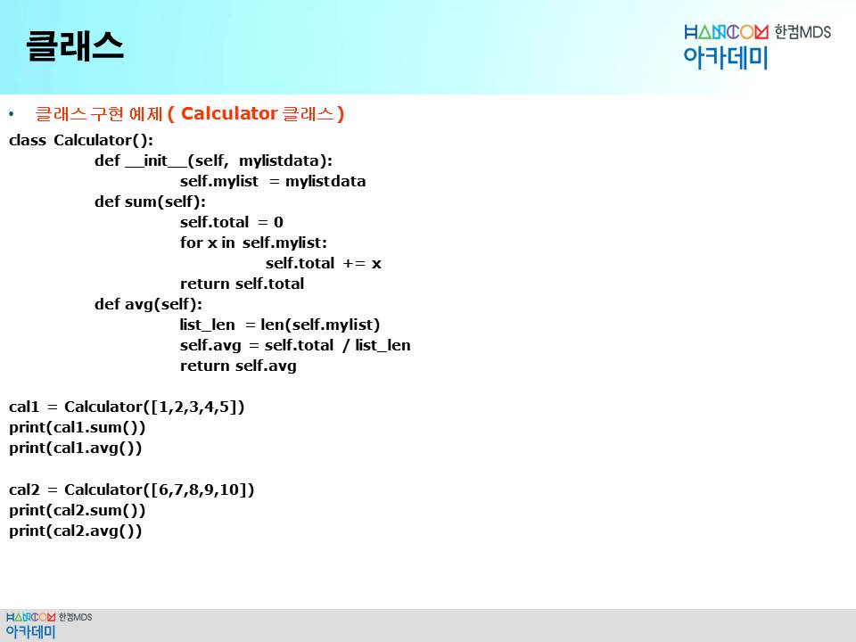

```python
class Calculator():
    def __init__(self, mylistdata):
        self.mylist = mylistdata
        
    def sum(self):
        self.total = 0
        for x in self.mylist:
            self.total += x
        return self.total

    def avg(self):
        list_len = len(self.mylist)
        self.avg = self.total / list_len
        return self.avg

cal1 = Calculator([1,2,3,4,5])
print(cal1.sum())
print(cal1.avg())

cal2 = Calculator([6,7,8,9,10])
print(cal2.sum())
print(cal2.avg())
```

>374

__외부에서 속성변수 추가

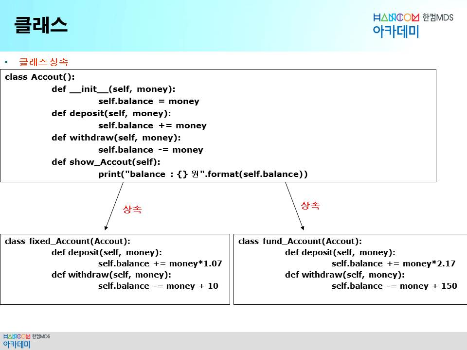

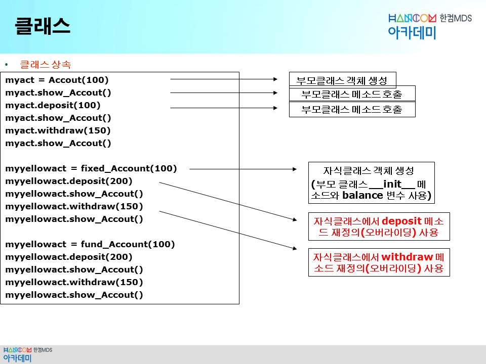

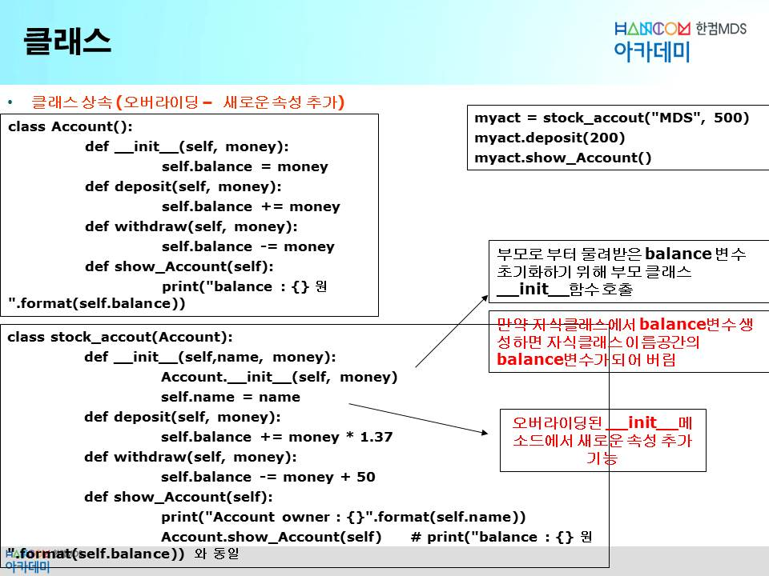

```
Account owner : MDS
balance : 774.0 원
```


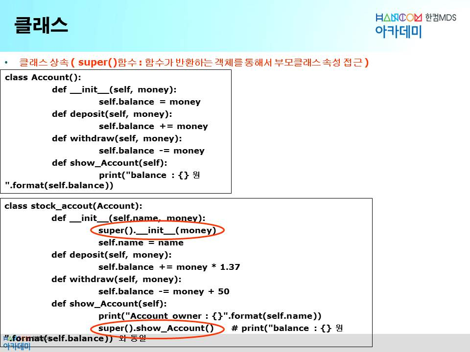

```
Account owner : MDS
balance : 774.0 원
```


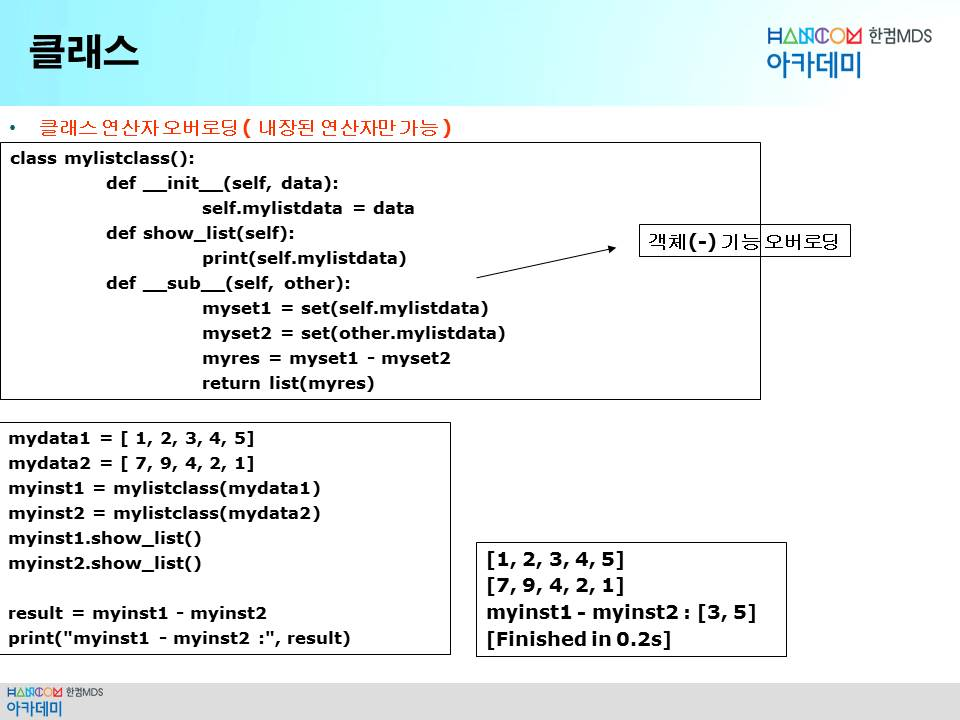

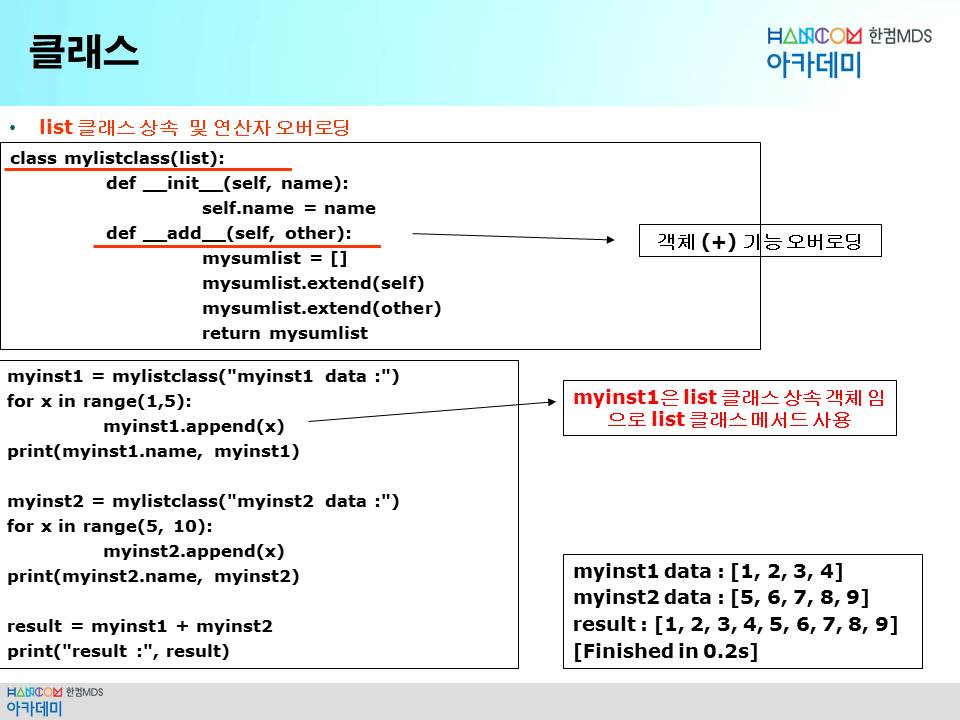

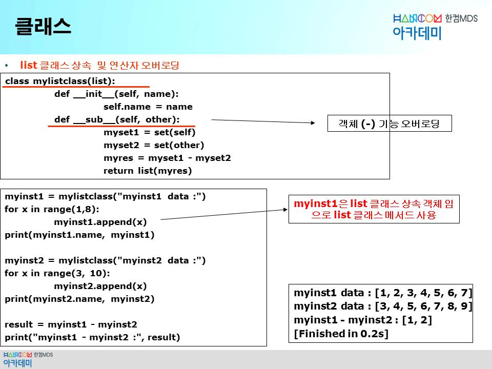


```python
class OverloadingTest:
    def __init__(self, tm):
        self.num = tm
    
    def show_data(self):
        print("self.num : ", self.num)
    
    def __add__(self, tm):      # 연산자 오버로딩
        self.num += tm

    def __sub__(self, tm):      # 연산자 오버로딩
        self.num -= tm

    def __radd__(self, tm):      # 연산자 오버로딩
        self.num += tm


mycls = OverloadingTest(50)
mycls.show_data()
# >>> self.num :  50

mycls + 30
mycls.show_data()
# + 는 값대 값만 가능하기에 오류
# C++에선 mycls.operator+(30) 연산자오버로딩 사용하는데
# 파이썬에도 있다.
# mycls.__add__(30) 이런식으로 사용

mycls - 30
mycls.show_data()

20 + mycls
mycls.show_data()
# 이렇게 하면 오류가 난다. 객체가 먼저와야하는데 연산자 오러로딩
# 객체. 해석. 근데 지금은 20이 먼저와서 20.add 이런 식이 안된다.
# cpp 에선 operator+(20,mycls) 전역함수. 이 클래스의 친구 friend
# 전역함수의 오버로딩. 
# def __radd__(self, tm) 사용
```


메모리는 그냥 접근 하면 되는데 파일은 하나의 장치개념

어플리케이션이 하드를 바로 제어 할 수 없으니까 파일 디스크립터(파일포인터 같은 개념)? fd가 파일을 리턴해준다.


---

[다시 # week 4 index 로](../w04.md)

[다시 # 전 과정 main 으로](../../README.md)
