***5주차 5일차 20190614 수업***

***20190616 마지막업데이트***

# Week 5 - Day 5 - 차량용 프로세서 디바이스 제어

## Project : Audio byPass and saving

s3c2450 soc칩과 wm8960 codec칩을 이용해 
1. mic - wm8960 통해 byPass 되어 speaker로 나오는, mic 음성신호 출력 확인
2. 다음 단계로 wm8960에서 바로 speaker가 아닌 DMA - s3c2450 - LCD 로 ADC 확인

>총 2가지 목표를 설정하고 접근했다. 주어진 시간은 6시간이었으나.. 은행업무로 잠시 판교를 한바뀌 돌다오느라(핑계) 3시간 만에 해결해야 했기에 reg와 datasheet 정리, 개념만 확인하고 차후에 접근하기로 했다. 


`일단 캡틴마블 사진 LCD 출력, DMA제어, s3c2450 reg 제어까진 한 상태에서 시작
`
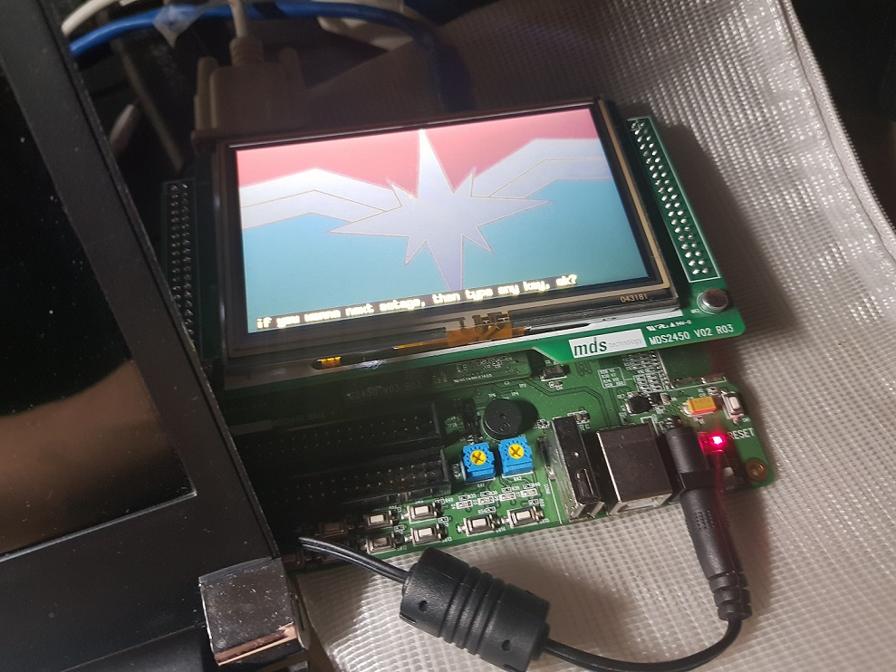


---

## Step : byPass

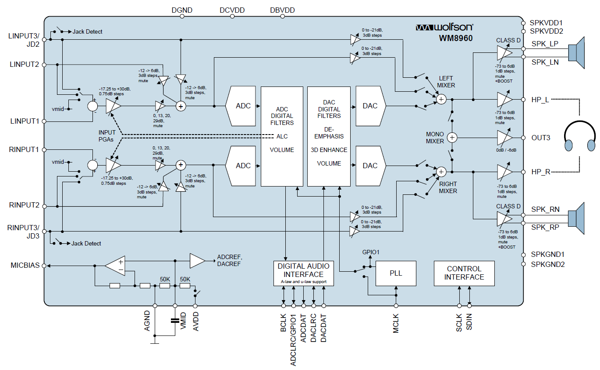


보드에 구성된 회로도를 보면 `RINPUT1` 없이 `LINPUT1` 만으로(1ch) 들어오고 어와 MUX와 opAmp를 지나 증폭된 신호가 `ADC`들어가기전에 바로 byPass 되어 스피커로 나갈 수 있는 path가 있다. 물론 가는 길목에 모든 reg를 잡아줘야겠지만..

### path

LINPUT1부터 ADC직전까지 지나가는 path 회로도를 보면 아래와 같고

* 신호가 들어와서
  * 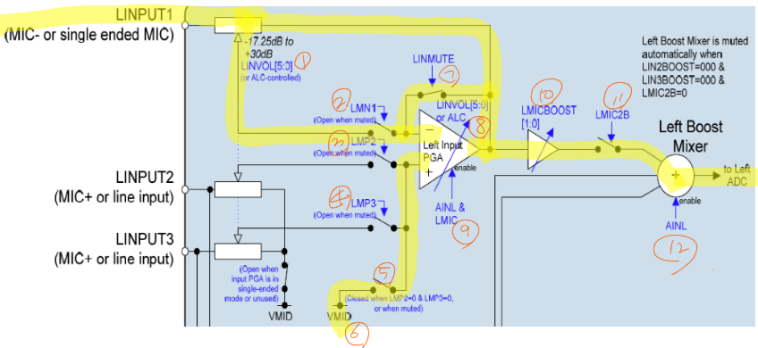
* byPass 로 나가는
  * 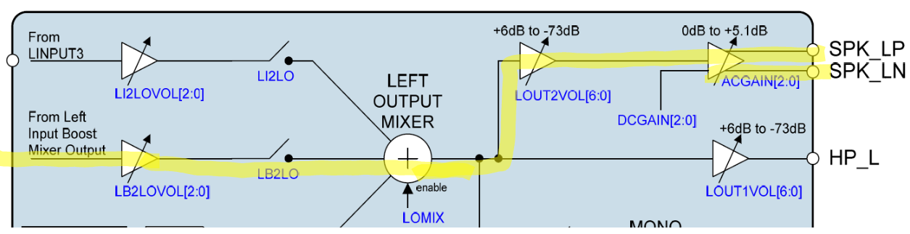


<!-- |R|ad|remarks|name|bit_default|bit|etc.|
|:---:|:---:|:---:|:---:|:---:|:---:|:---:|
|R15|0F|reset|
|R25|19|pwr mgmt|VMIDSEL 

R25 (19h) Power Management (1)

8:7 VMIDSEL

01 = 2 x 50k divider enabled (for playback / record) -->

### reg

건드려야할 reg 는 아래와 같고

<!--  -->

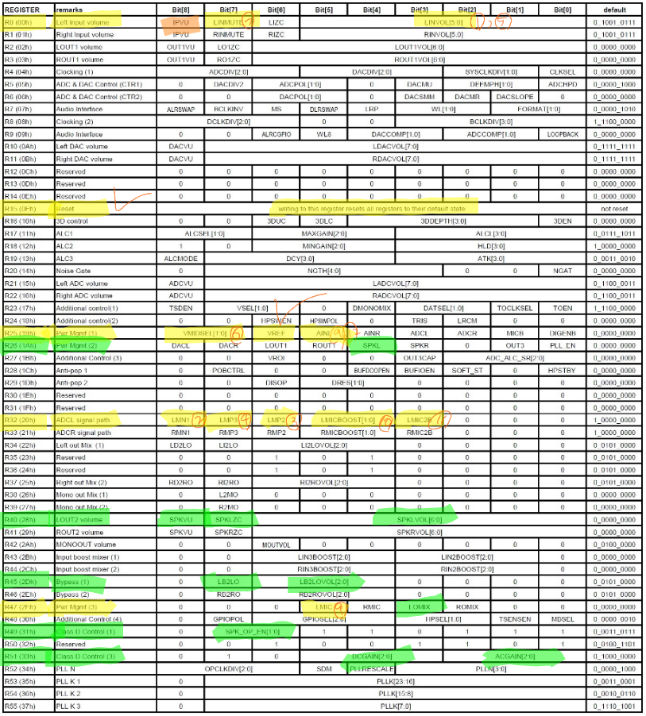


* input 부분 선언 및 초기화 확인
  * 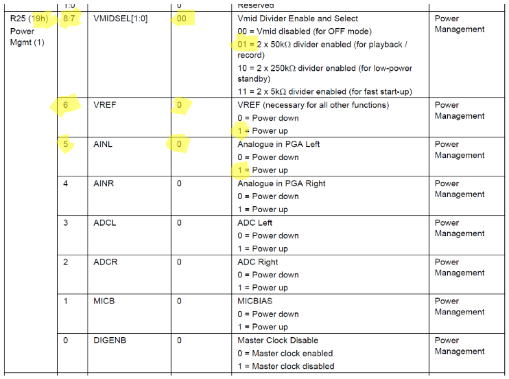
  * 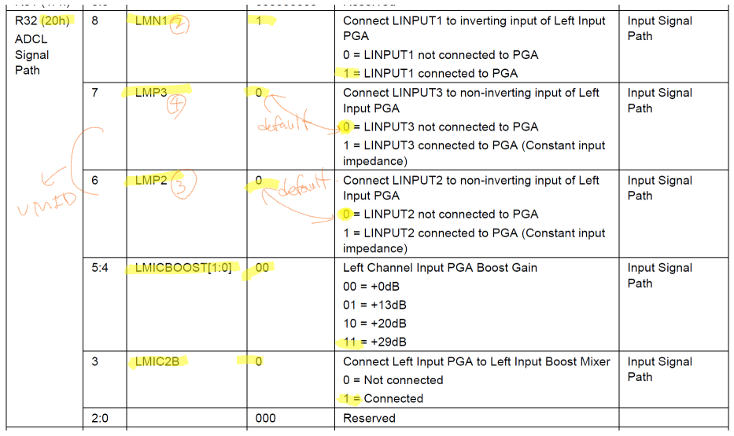
  * 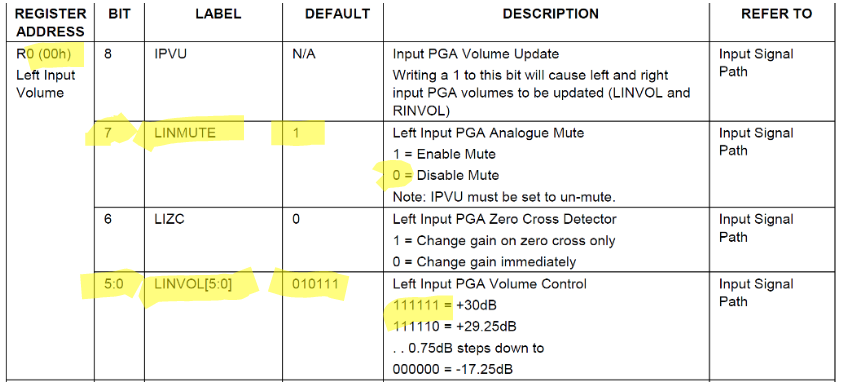
* output 부분
  * 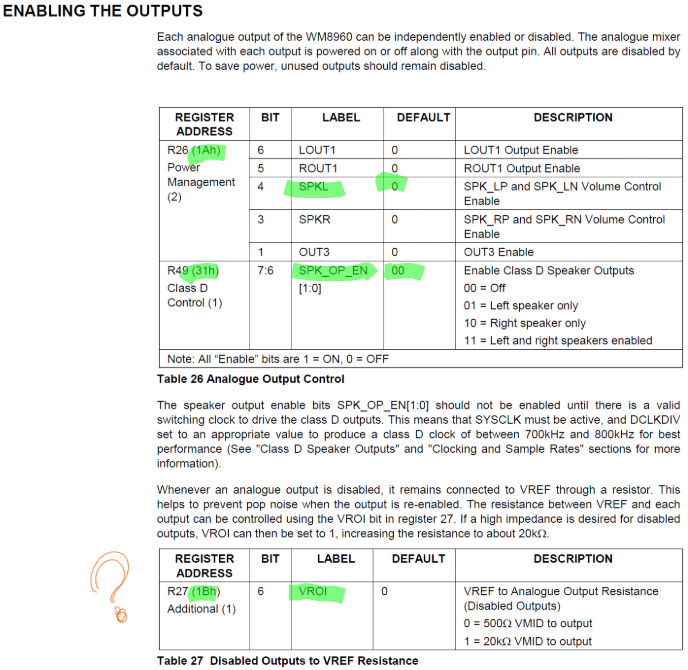
  * 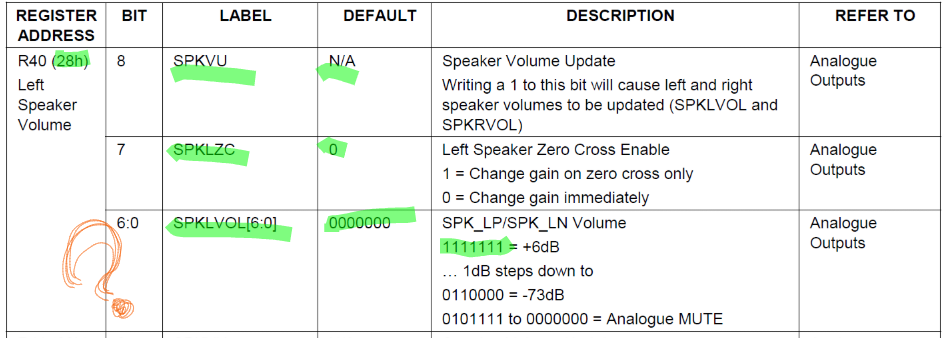


대충 아래와 같이 선언하고 구조체 확인하고 정리한 뒤 Audio 신호 입력 단만 정리한 뒤. 뒤쪽 출력단은 기존 example로 대체~

```c
#define WM8960_LINVOL		0x0     //R0
#define WM8960_RESET		0xf     //R15
#define WM8960_LINPATH		0x20    //R32 ADCL signal path
#define WM8960_POWER1		0x19    //R23 Pwr Mgmt 1
#define WM8960_POWER3		0x2f    //R47 Pwr Mgmt 3 
```

```c
struct WM8960_REG {
	unsigned char addr;
	unsigned char data;
};
```
<!-- void WriteCodecModule( char CodecIICID, char Addr, char Data);
void ReadCodecModule( char CodecIICID, char Addr, char *Data);
void SetupCodecModule( char CodecIICID, WM8960_REG CodecModulData[], int CodecModuleDataSize); -->

```c
{((WM8960_RESET<<1)+0x0), 0x00},    //Reset WM8960
{((WM8960_POWER1<<1)+0x0), 0xE0},   //VMID=50K, Enable VREF, AINL
{((WM8960_POWER3<<1)+0x0), 0x28},   //Enable left channel input PGA, LMIC, LOMIX 출력부분까지 해결
{((WM8960_LINVOL<<1)+0x1), 0x3F},   //Unmute Left input PGA (LINMUTE), LINVOL = 0dB, Volume Update IPVU 몽땅최대 0011F
{((WM8960_LINPATH<<1)+0x1), 0x38}   //Left Input PGA to Left Input Mixer (LMIC2B), Boost = 29dB   1.0011.1000
```
여기까지 하면 input 부분 잡았겠지?

<!-- ```c 예제
struct WM8960_REG WM8960_MIC_init[]= {

    {((WM8960_RESET<<1)+0x0), 0x00},	//Reset WM8960                                                                                                  
    {((WM8960_POWER1<<1)+0x0), 0xEA},	//VMID=50K, Enable AINL and MICBIAS                                                                          
    //{((WM8960_POWER2<<1)+0x0), 0x40},	//Enable LOUT1                                                                                               
    {((WM8960_POWER3<<1)+0x0), 0x28},	//Enable left output mixer, Enable Left Input PGA                                                            
    {((32<<1)+0x1), 0x28},	//Not Connect LINPUT2 to non-inverting PGA (LMP2), LMICBOOST = +20dB, Connect left input PGA to Left input mixer 
    {((33<<1)+0x0), 0x00},	//Disconnect RINPUT1 to input PGA (RMN1)                                                                     
    {((00<<1)+0x1), 0x3e},	//Unmute left input PGA (LINMUTE), Left Input PGA Vol = 0dB, Volume Update                                   
    //{((45<<1)+0x0), 0x80},	//Left Input Boost mixer to Left output mixer (LB2L0), Vol = 0dB                                             
    //{((02<<1)+0x1), 0x79},	//LOUT1 Vol = 0dB, volume update enabled                                                                     
    {((48<<1)+0x0), 0x02},	//Microphone Bias Voltage Control = 0.65 * AVDD    
    //ADC control converter 
    {((5<<1)+0x0), 0x00},	//ADC polarity control Not inverted
    {((23<<1)+0x0), 0x00},	//ADC Data Output Select 
    {((21<<1)+0x1), 0xfE},	//LADCVOL volumn control 

	//with ADCLRC must be set  ALRCGPIO set 1 
    {((9<<1)+0x0), 0x60},	//ALRCGPIO GPIO Pin 
  };
``` -->

```c
#define WM8960_POWER2		0x1a    //R26
#define WM8960_LOUT2		0x28    //R32
```

```c
{((WM8960_POWER2<<1)+0x0), 0x10},   //Enable Left Speaker SPKL
{((WM8960_LOUT2<<1)+0x0), 0x10},   //Enable Left Speaker SPKL
```
확인해볼꺼 `CLASS D SPEAKER OUTPUTS`


## 결과

`MUX` 부분에서 DAC 부분끄고 byPass단 PGA 끌어다 붙였는데.. 

* DAC 부분끄고
  * `WM8960_LOUTMIX1 ==>> LD2LO 설정`
* PGA 끌어다 붙였!
  * `WM8960_POWER3 ==>> LMIC, LOMIX 설정`
* 나머진 안건딈

```c
#define PLAY_nwnw01  4

//WM8960_nwnw01
//only LD2LO off and LB2LO on!
struct WM8960_REG WM8960_nwnw01[]= {

	{((WM8960_RESET<<1)+0x0), 0x00},			//Reset WM8960   
	{((WM8960_APOP1  	<<1)+0x0), 0x94},		//Enable POBCTRL, SOFT_ST and BUFDCOPEN
    {((WM8960_APOP2  	<<1)+0x0), 0x40},		//Enable DISOP
	{WM8960_DELAY, 0x19},						//Delay (400mS) to remove any residual charge on HP output.    
	{((WM8960_POWER2 	<<1)+0x0), 0x7f},		//Enable LOUT1 and ROUT1
	{((WM8960_APOP2  	<<1)+0x0), 0x00},		//Enable DISOP
	{((WM8960_POWER1 	<<1)+0x0), 0xE0},		//Enable VMID SEL = 2x50K Ohm Dividere
	{WM8960_DELAY, 0x64},				//Delay (50mSeconds) to allow HP amps to settle
	{((WM8960_APOP1  	<<1)+0x0), 0x01},		//Enable POBCTRL, SOFT_ST and BUFDCOPEN
	{((WM8960_POWER2 	<<1)+0x1), 0xf8},		//Enable LOUT1 and ROUT1
	{((WM8960_ADDCTL1	<<1)+0x1), 0xD1},		//
	{((WM8960_POWER3  	<<1)+0x0), 0x2C},		//Enable left channel input PGA, LMIC, LOMIX done from output part ==>>LMIC on
	{((WM8960_LOUTMIX1	<<0)+0x1), 0x50},		//Enable Left DAC to left mixer (LINPUT3 to Output Mixer)	==>>LD2LO OFF
	{((WM8960_ROUTMIX2	<<1)+0x1), 0x50},		//Enable Right DAC to right mixer    
	{((WM8960_ADDCTL4	<<1)+0x0), 0x0A},		// JD2 used for Jack Detect Input
	{((WM8960_ADDCTL2	<<1)+0x0), 0x40},		// HPDETECT HIGH = Speaker 
	{((WM8960_ADDCTL3	<<1)+0x0), 0x08},		// HPDETECT HIGH = Speaker 

//output part
	{((WM8960_BYPASS1<<1)+0x0), 0xF0},	//Enable Left input boost to left output mixer (LB2LO), Left Vol = 0dB             
//input part
	// {((WM8960_RESET<<1)+0x0), 0x00},    //Reset WM8960
	// {((WM8960_POWER1<<1)+0x0), 0xE0},   //VMID=50K, Enable VREF, AINL
	// {((WM8960_POWER3<<1)+0x0), 0x28},   //Enable left channel input PGA, LMIC, LOMIX 출력부분까지 해결
	{((WM8960_LINVOL<<1)+0x1), 0x3F},   //Unmute Left input PGA (LINMUTE), LINVOL = 0dB, Volume Update IPVU 몽땅최대 0011F
	{((WM8960_LINPATH<<1)+0x1), 0x38},   //Left Input PGA to Left Input Mixer (LMIC2B), Boost = 29dB   1.0011.1000


//PLL 12.288MHz	 SysCLK 12.288MHz	F2 98.304 MHz
	//CLKSEL = 0
	//MS = 0
	//WL = 10
	//SYSCLKDIV =0
	//ADCDIV=000
	//DACDIV=000
	
	{((WM8960_CLOCK1  	<<1)+0x0), 0x00}, 		// DACDIV, CLKSEL
	{((WM8960_IFACE1  	<<1)+0x0), 0x00},

	{((WM8960_LOUT1   	<<1)+0x1), 0x79},		//LOUT1VOL (HP) = -20dB
	{((WM8960_ROUT1   	<<1)+0x1), 0x79},		//ROUT1VOL (HP) = -20dB, Enable OUT1VU, load volume settings to both left and right channels
	{((WM8960_LOUT2   	<<1)+0x1), 0x79},		//LOUT2VOL (HP) = -20dB
	{((WM8960_ROUT2   	<<1)+0x1), 0x79},		//ROUT2VOL (HP) = -20dB, Enable OUT2VU, load volume settings to both left and right channels
	{((WM8960_CLASSD3 	<<1)+0x0), 0xcc},		//Left and Right Speakers Enabled	
	{((WM8960_IFACE1  	<<1)+0x0), 0x02},		//
	{((WM8960_CLASSD1 	<<1)+0x0), 0xf7},		//Left and Right Speakers Enabled	
	{((WM8960_DACCTL1 	<<1)+0x0), 0x04}		//DAC Digital Soft Mute = Unmute (Delay from R25 = 080 to unmute >250mS)
	
};

```


어쨌든 결론은 실패.ㅠㅠ

왜 안되니야~~~~~ 뭘 빼먹노ㅑ노ㅑㅗ노ㅑㄴ~  


주말 내내.. 토욜에는 리눅스 우분투 환경설정하느라 하루버리고 일욜 오늘 하루는 역시 솹질과 함께!~


<!-- /* L/RINPUT1 to L/ROUT1 Bypass */ -->

<!-- {((01<<1)+0x1), 0x17},              //Unmute Right input PGA (RINMUTE), RINVOL = 0dB, Volume Update
{((33<<1)+0x1), 0x08},              //Right Input PGA to Right Input Mixer (RMIC2B), Boost = 0dB
{((46<<1)+0x0), 0x80},              //Right Input Boost mixer to Right output mixer (RB2R0), Vol = 0dB
{((03<<1)+0x1), 0x79}               //ROUT1 Vol = 0dB, volume update enabled -->
<!-- {((45<<1)+0x0), 0x80},              //Left Input Boost mixer to Left output mixer (LB 2L0), Vol = 0dB 안건들고 -->
<!-- {((02<<1)+0x1), 0x79},              //LOUT1 Vol = 0dB, volume update enabled // 볼륨도 안건들고 -->


<!-- 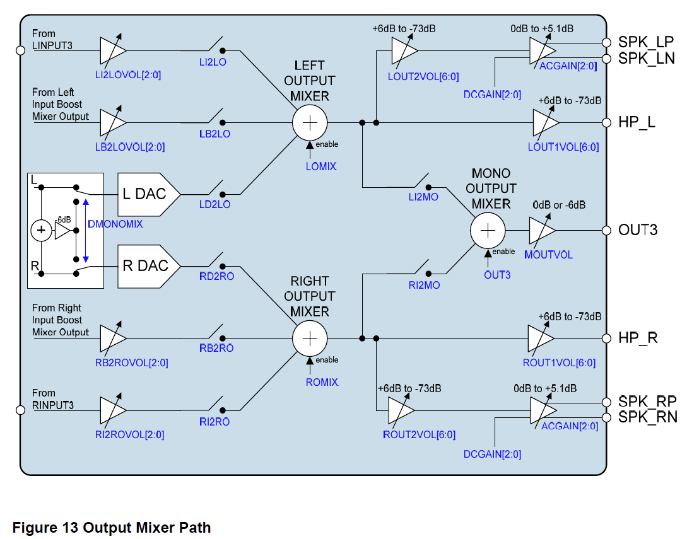 -->

<!-- 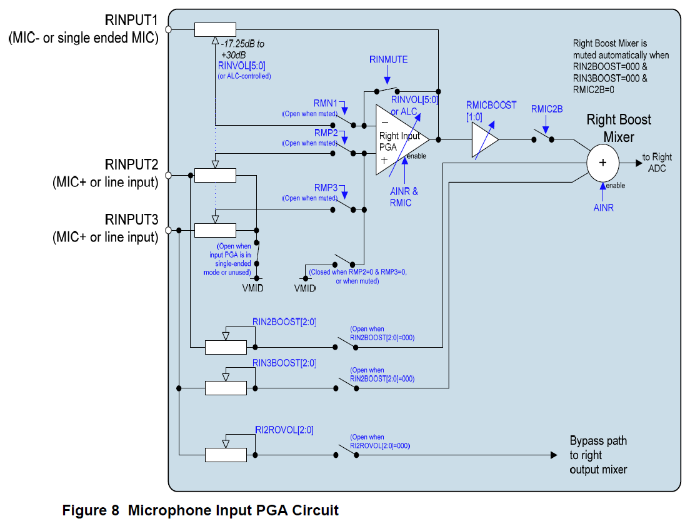 -->

<!-- 


-->


---
[다시 # week 5 index 로](../../w05.md)

[다시 # 전 과정 main 으로](../../../README.md)


