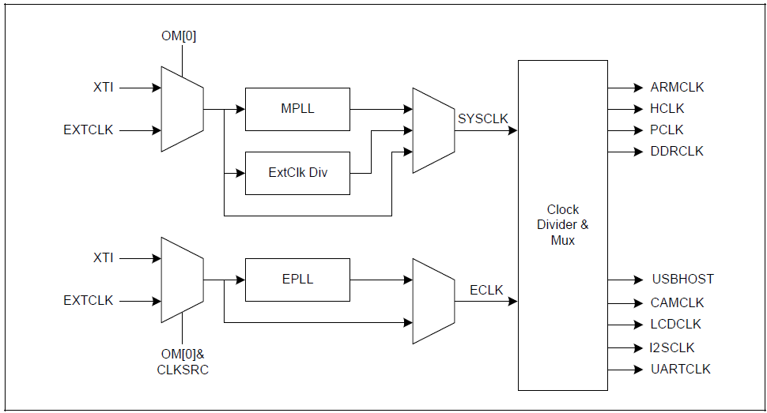
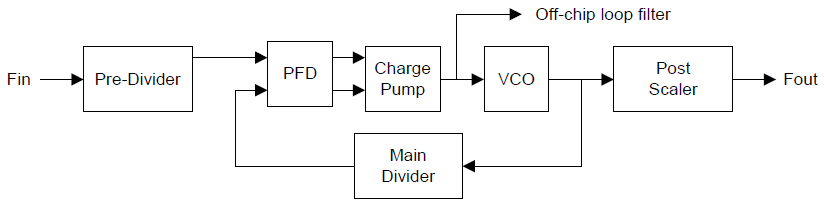
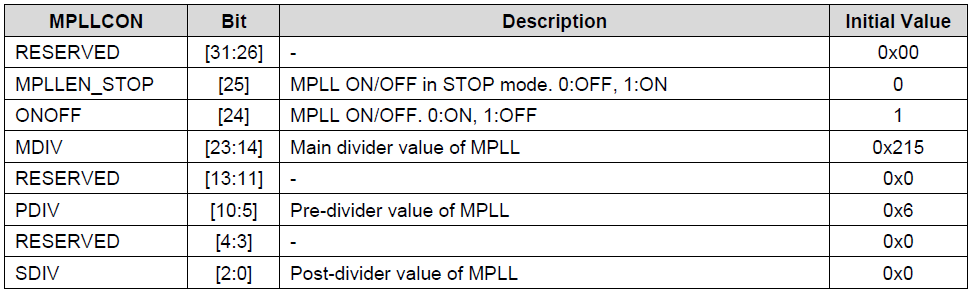
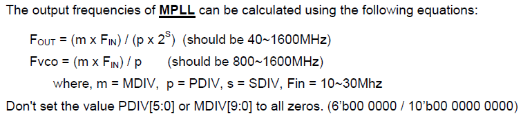
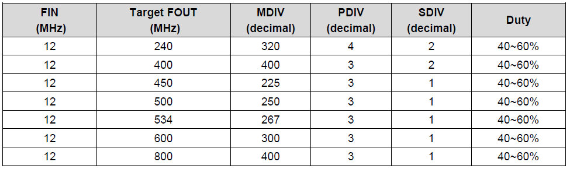
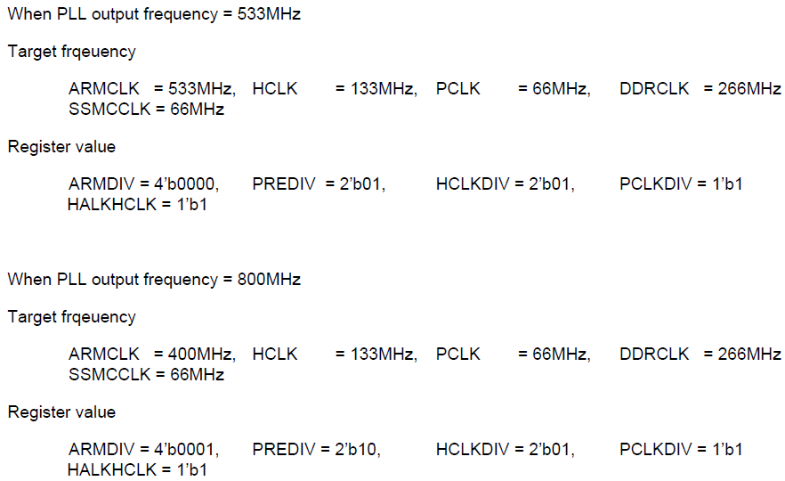
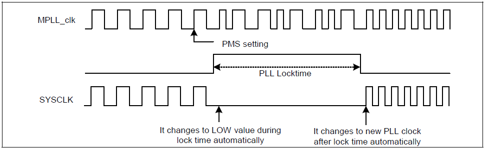
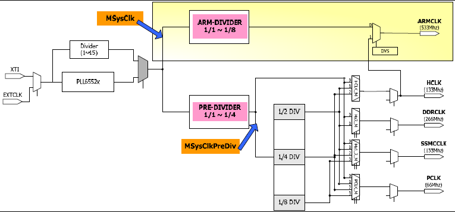

<!-- 
>Cross Compiler 란?  
>assembler, compiler linker 모두 처리해주는, GNU compiler 같은

### ARM Processor Core Architecture

ARM Architecture는 v1 부터 ARM11은 v6까지 발전하고 있다.

|        | Architecture | Pipeline | Bus Architecture |
| :----: | :----------: | :------: | :--------------: |
|  ARM9  |     v4T      |    5     |   Von Neumann    |
| ARM9E  |     v4T      |    5     |      Havard      |
| ARM10  |     v5TE     |    6     |      Havard      |
| ARM11  |      v6      |    8     |      Havard      |
| xScale |     v5TE     |   7~8    |      Havard      |

>하버드랑 폰 노이만의 차이? 

* AMBA는 ARM Ltd사에서 무료로 뿌린, 사실상의 표준으로 마이크로컨트롤러 장치를 넘어 ASIC과 SoC 분야에서 널리 사용하고 있다.
* 어드밴스트 마이크로컨트롤러 버스 아키텍처
* Advanced Microcontroller Bus Architecture
* AMBA는 시스템 칩 (system-on-a-chip : SoC) 설계에서 사용하는 버스 아키텍처
 -->

<!-- * SAMSUNG's S3C2450 16/32-bit RISC microprocessor.
* The S3C2450 is developed with ARM926EJ core, 65nm CMOS 표준 셀 및 메모리 컴파일러로 개발
* Advanced Micro controller Bus Architecture (AMBA)
* The S3C2450 offers outstanding features with its CPU core, a 16/32-bit ARM926EJ RISC processor designed by
Advanced RISC Machines, Ltd. The ARM926EJ implements MMU, AMBA BUS, and Harvard cache architecture with separate 16KB instruction and 16KB data caches, each with an 8-word line length.
By providing a complete set of common system peripherals, the S3C2450 minimizes overall system costs and
eliminates the need to configure additional components.  -->

<!-- 
• Around 400MHz @ 1.3V, 533MHz @ TBDV Core, 1.8V/2.5V/3.0V/3.3V ROM/SRAM, 1.8V/2.5V
mSDR/mDDR/DDR2 SDRAM, 1.8V/2.5V/3.3V external I/O microprocessor with 16KB I/D-Cache/MMU
• External memory controller (mSDR/mDDR/DDR2 SDRAM Control and Chip Select logic) and CF/ATA I/F
controller
• LCD controller (up to 256K color) with LCD-dedicated DMA
• 8-ch DMA controllers with external request pins
• 4-ch UARTs (IrDA1.0, 64-Byte Tx FIFO, and 64-Byte Rx FIFO)
• 2-ch High Speed SPls
• 2 IIC bus interfaces (multi-master support)
• 2 IIS Audio CODEC interfaces (24-bit, port 0 supports 5.1ch, port 1 supports 2ch)
• AC97 CODEC Interface
• 2 High-Speed MMC and SDMMC combo (SD Host 2.0 and MMC protocol 4.2 compatible)
• 2-ch USB Host controller (ver 1.1 Compliant)/1-ch USB Device controller (ver 2.0 Compliant)
• 4-ch PWM timers / 1-ch Internal timer / Watch Dog Timer
• 10-ch 12-bit ADC and Touch screen interface
• RTC with calendar function
• Camera interface (Max. 8M pixels input support. 2M pixel input support for scaling)
• 174 General Purpose I/O ports / 24-ch external interrupt source
• Power control: Normal, Idle, Stop, Deep Stop and Sleep mode
• On-chip clock generator with PLL

이 사용 설명서는 SAMSUNG의 S3C2450 16/32 비트 RISC 마이크로 프로세서에 대해 설명합니다. 삼성의 S3C2450은
저전력 및 고성능 마이크로 컨트롤러와 함께 휴대용 장치 및 일반 애플리케이션을 제공하도록 설계되었습니다.
작은 다이 크기의 솔루션. 총 시스템 비용을 줄이기 위해 S3C2450에는 다음과 같은 구성 요소가 포함되어 있습니다.
S3C2450은 ARM926EJ 코어, 65nm CMOS 표준 셀 및 메모리 컴파일러로 개발되었습니다. 저전력,
간단하고 우아하며 완전히 정적 인 디자인은 비용 및 전력에 민감한 어플리케이션에 특히 적합합니다. 그것
Advanced Micro Controller Bus Architecture (AMBA)라고 알려진 새로운 버스 아키텍처를 채택했습니다.
S3C2450은 CPU 코어, 16 / 32 비트 ARM926EJ RISC 프로세서로 뛰어난 기능을 제공합니다.
Advanced RISC Machines, Ltd. ARM926EJ는 MMU, AMBA BUS 및 하버드 (Harvard) 캐시 아키텍처를 구현합니다.
별도의 16KB 명령어 및 16KB 데이터 캐시가 있으며 각 캐시 워드는 8 워드 길이입니다.
S3C2450은 완벽한 시스템 주변 장치 세트를 제공함으로써 전반적인 시스템 비용을 최소화하고
추가 구성 요소를 구성 할 필요가 없습니다. 에 설명 된 통합 온칩 기능
이 문서에는 다음 내용이 포함됩니다.
• 약 400MHz @ 1.3V, 533MHz @ TBDV 코어, 1.8V / 2.5V / 3.0V / 3.3V ROM / SRAM, 1.8V / 2.5V
mSDR / mDDR / DDR2 SDRAM, 16KB I / D 캐시 / MMU를 갖춘 1.8V / 2.5V / 3.3V 외부 I / O 마이크로 프로세서
• 외부 메모리 컨트롤러 (mSDR / mDDR / DDR2 SDRAM 컨트롤 및 칩 셀렉트 로직) 및 CF / ATA I / F
제어 장치
LCD 전용 DMA가있는 LCD 컨트롤러 (최대 256K 컬러)
외부 요청 핀이있는 8 채널 DMA 컨트롤러
• 4 채널 UART (IrDA1.0, 64 바이트 Tx FIFO 및 64 바이트 Rx FIFO)
• 2 채널 고속 SPL
• 2 개의 IIC 버스 인터페이스 (멀티 마스터 지원)
• 2 개의 IIS 오디오 코덱 인터페이스 (24 비트, 포트 0은 5.1ch를 지원하고, 포트 1은 2ch를 지원함)
• AC97 CODEC 인터페이스
• 2 개의 고속 MMC 및 SDMMC 콤보 (SD 호스트 2.0 및 MMC 프로토콜 4.2 호환)
• 2 채널 USB 호스트 컨트롤러 (ver 1.1 호환) / 1 채널 USB 장치 컨트롤러 (ver 2.0 호환)
• 4 채널 PWM 타이머 / 1 채널 내부 타이머 / 워치 도그 타이머
• 10 채널 12 비트 ADC 및 터치 스크린 인터페이스
• 달력 기능이있는 RTC
• 카메라 인터페이스 (최대 8M 픽셀 입력 지원, 스케일링을위한 2M 픽셀 입력 지원)
• 174 개의 범용 I / O 포트 / 24-ch 외부 인터럽트 소스
• 전원 제어 : 정상, 유휴, 정지, 딥 중지 및 절전 모드
• PLL이 내장 된 온칩 클록 발생기 -->

*updated 2019-06-11 by nw*
# CLOCK MANAGEMENT

삼성 S3C2450은 ARM926EJ 코어, 65nm CMOS 표준 셀 및 메모리 컴파일러로 개발되어 533MHz을 가지고 있다고 한다. 그럼 533MHz가 어떻게 나오게 된 거고 어떻게 쓰이며 그 과정을 찾아가 봤다.

>Q  
>왜 533? 800도 가능할텐데?

## CLOCK GENERATION OVERVIEW

왼쪽을 보면 XTI와 EXTCLK가 있다. MUX에서 크리스탈과 외부클럭을 선택할 수 있다는 말
* XTI = external crystal
* EXTCLK = external clock

>Q 98p  
GFM(Glitch Free Mux)’s output can be configured easily without generating glitch

위에 아래, 두 개로 나눠져 있는건 S3C2450은 2개로 나눠진 기능을 가지고 있다는 뜻

X-TAL OSC에서는 12MHz의 주파수가 나오고 대부분의 clock generation에서는 낮은 주파수를 PLL을 거쳐서 증폭시켜 원하는 커다란 주파수를 만든다.

* PLL = Phase Looked Loop

위 그림에서 PLLs(MPLL, EPLL)가 그런 역할을 하고 있다.

PLL의 내부 블록다이어그램을 보면 아래와 같다.

`Fin`에서 12MHz 주파수의 X-TAL OSC가 들어가고 증폭이 루프를 거쳐 증복되어 `Fout`가 되어 나간다. 먼저 *목표값*을 설정하고 Pre-Divider, Main-Divider, Post-Divider 를 레지스터 수정을 통해 원하는 목표값에 맞춘다. 우리가 주로 사용한 `PCLK` = 66MHz를 만들기 위해 그 과정을 계산해보면

[추가 참고자료](https://www.analog.com/media/en/training-seminars/tutorials/MT-086.pdf)

레지스터에서 MDIV, PDIV, SDIV에 각각의 Divider value of MPLL을 확인해본 후

위의 주어진 공식에 맞춰서 원하는 값을 계산한다.

대부분 데이터시트에 설정값을 제시해놨다. 그대로 맞춰서 쓰면 될거 같다. 

>Q 교재는 공식에 왜 2를 곱했을까?

$F_{OUT} = (m * F_{in}) / (p * 2^S)$

| $F_{in}$ | MDIV  | PDIV  | SDIV  | $F_{OUT}$ |
| :------: | :---: | :---: | :---: | :-------: |
|  12MHz   |  267  |   3   |   1   |  534MHz   |

이렇게 534MHz를 출력시키는 이유가 뭘까? 왜 데이터시트에는 이런 내용을 넣었을까? 아래처럼 암바클럭에 맞춰진 클럭 예제를 왜 제공하고 있을까?

5.7 EXAMPLES FOR CONFIGURING CLOCK REGITER TO PRODUCE SPECIFIC FREQUENCY OF AMBA
CLOCKS.

>Q 왜 ARMCLK 533MHz로 PCLK 66MHz 로 데이터시트에 샘플로 지정했을까? 하필이면?

>Q 그림이해 안됨

##

PLL(우리는 MPLL)을 통해 출력된 534MHz 값 MPLL_clk(Main Clock) 를 우리가 사용할 클럭(SYSCLK)으로 나누게 된다.
* ARMCLK
  * CPU를 위한
* HCLK
  * AHB 버스에 연결된 주변장치를 위한
  * 메모리 컨트롤러, 인터럽트 컨트롤러, LCD 컨트롤러, DMA 컨트롤러 USB 호스트 컨트롤러
* PCLK
  * APB 버스에 연결된 주변장치를 위한
  * 워치독 타이머, IIS, IIC, PWM 타이머, MMC, ADC, UART, GPIO, RTC, SPI
* DDRCLK

클럭 다이어그램을 다시 MPLL Based Clock Domain으로 그려보면

* 왼쪽 상단에 PLL을 통해 나가는 534MHz는 상단에 분홍색으로 칠해져 있는 ARM-DIVIDER 를 지나 1/1~1/8 나눠지지고 ARMCLK으로 출력되며 -> 534MHz
* PLL을 통해 밑으로 내려간 534MHz 클럭은 분홍색 Pre-Divider에 의해 1/1~1/4 까지 선택적으로 나눌 수 있고 또 다시 한번 MUX를 통해 최종 원하는 값으로 나눌 수 있다.

우리가 목표로 하는 또 데이터시트에서 추천하는 66MHz를 위해서는 

* ARMCLK 은 1:1 로 그대로 가게 설정하고 -> 534MHz
* Pre-Divider 는 1:2로 -> 267MHz
  * Pre-Divider를 통과한 클럭을 다시
    * HCLK는 1/2 로 반으로 나눈거고 -> 133MHz
      * PCLK는 HCLK를 1/2로 나눈거니 Pre-Divider의 1/4 -> 66MHz

다시 정리해보면, 원 클럭 534MHz와 비교하면 ***1:4:8 로 534MHz이 66MHz으로 PCLK 출력이 된다***.

