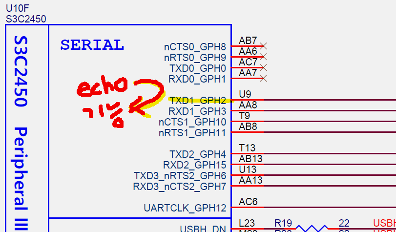
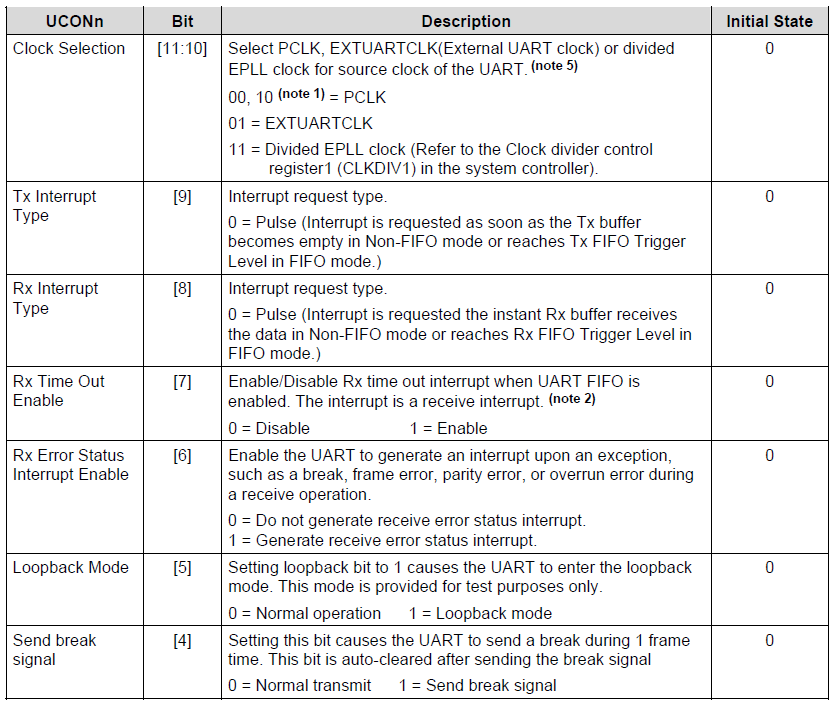
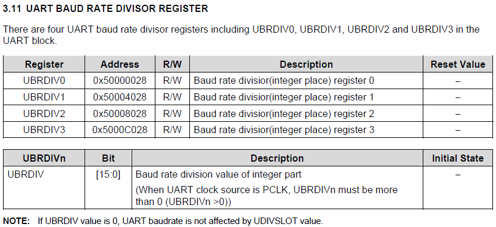

***5주차 2일짜 20190611 수업***

***20190611 마지막업데이트***

# Week 5 - Day 2 - 차량용 프로세서 디바이스 제어


## pull-up and pull-down

<!--  -->

풀업, 풀다운 설정 하는 레지스터 있는지 확인.

GPE14 찾았고 I2C 로 쓰려면 비트 10으로 ***얼터네이티브 펑션 제3의 기능*** 


## UART


rs232c 트렌시버


50년전 만들어진 기술

I2C는 무조건 풀업ㅈ더항으로 달아야 한다. 그래서 메뉴얼보고 회로도 보고 풀업 없으니까 외부설계시 달아줘야한다. 안달아도 되고 이미 있다면 믿고 쓰면 된다!

디지털을 보내고 받는 장치

`hexdump -C exception.o |more`


'\n' (줄바꿈) 0x0a 개행 

동조

BPS 1초에 몇번을 보내는, 115,200bps 다 하면 초당 115200 bit를 보내는 속도

비동기 
* 한줄로 보내는, 시작비트와 정지비트로 싱크를 맞추는게

동기
* 두줄로 보내는, 동기는 IIC 클럭과 data로 나눠서 


```c
#define WrUTXH1(ch) (*(volatile unsigned char *)0x50004023)=(unsigned char)(ch)
```
```c
WrUTXH1(ch) (*(volatile unsigned char *)0x50004023)='h'
```

```c
void Uart_Init(int baud)
{
	int pclk;   
	pclk = PCLK;    // AMBA APB 버스클럭
```
암바버스

https://blog.naver.com/guile21c/52117520

usb, pcl i2c 정보가 전달되는 파이프라인, 버스

arm 사에서 만든? amba 버스. arm 사의 버스규격. arm soc에선 이 버스만 사용. 


다 묶어서 amba라 부른다.


ahb asb 하이 고속도로
apb 로우 지방도로 국도

uart도 cpu처럼 66m 클럭이다? 그럼 apb클럭이 66m

같은 동일 클럭이 66m 클럭으로 돈다.


```c option.h
// Frequency setting

#define	FCLK		534000000	// 534.000MHz (400MHz)
#define	HCLK		(FCLK/4)		// 133.000MHz (100MHz)
#define	PCLK		(FCLK/8)		// 66.0000MHz (50MHz)
```


```
UART 설정
ULCON – connection 관련 설정
UCON – UART 내부 동작 설정
UFCON – FIFO 설정
UMCON – flow control 설정
UBRDIV – baud rate (속도) 설정

Status
UTRSTAT – 데이터 전송 상태
UERSTAT – 에러 상태
UFSTAT – FIFO 상태
UMSTAT – flow control 관련 상태

Data 레지스터
UTXH – TX buffer 레지스터
URXH – RX buffer 레지스터
```


`rGPHCON = (rGPHCON &~ (0xF<<4))|(0xA<<4);`


모두 위에 0인 이유 아무리 뭘 건드려도 
결국 FIFO가 0 이니까 그 안에 다른 걸 건드려도 어차피 꺼 있으니까 상관이 없다.

2.1.9 Infrared (IR) Mode

적외선 UART 기능 ULCONn 안쓰니까 0
패리티비트. 


```c
void Uart_Send_String(char *pt)  
{
    while((*pt)!='\0')
    {
        Uart_Send_Byte(*pt);
        pt++;           // 문자 하나씩 증가시키면서 문자열 출력
    }
}
```


```c
void Uart_Send_Byte(int data)
{
    if(data=='\n')                      //개행문자
    {
        while(!(rUTRSTAT1 & 0x2));
        WrUTXH1('\r');
    }

    /* TODO : UTRSTAT0의 값을 확인하여 TX 버퍼가 비어있으면 문자 출력   */ 
    //Tx 부에서는 일단 Transmit Buffer을 비워주고 ; 왜냐면? 내꺼만 쓸라고...
    //레지스터에 값을 기록 한다. 
    //Transmit Shifter로 적재 
    //기록된 값은 baud rate에 맞춰 송신

    while(!(rUTRSTAT1 & 0x2));	
    WrUTXH1(data);
}
```

```c
char Uart_GetChar(void)
{
    /* UTRSTAT1의 값을 확인하여 문자열 입력   */	
    // rUTRSTAT1
    // rUTRSTAT0 init => 0 , 값이 들어올 때까지 while문 계속 돌면서 대기 모드
    // receiver buffer에 값이 들어오면 1로 바뀌면서 while 문 빠져나가고
    // 문자를 찍는다.
    while(!(rUTRSTAT1 & 0x1));
        return rURXH1;              //0x50000024 주소에 있는 값
}
```


alias pbcopy='xclip -selection clipboard'
alias pbpaste='xclip -selection clipboard -o'
alias m='minicom -w -D/dev/ttyS0'
alias h='history'


user@linux:~/Desktop/m2450/lab/student/04_DeviceControl_Student$ subl ~/.bashrc
user@linux:~/Desktop/m2450/lab/student/04_DeviceControl_Student$ source ~/.bashrcuser@linux:~/Desktop/m2450/lab/student/04_DeviceControl_Student$ 


rUCON1  = (1<<2)|(1);     





루프벡기능.







UBRDIV1=

통신속도 조절

반올림 

27보다 더 큰 순자.

	rUBRDIV1= ((unsigned int)(PCLK/16./baud+0.5)-1 );

PCLK  66000000
baud  115200


38000 옛날

115200
오랜시간 10년 썼다.

uart의 한계 더 이상 올렸더니 깨지더라. 

## 예제풀이

tx 는 어떻게? 하는 것인가!

글자를 보내는 


```c
#if EXAMPLE == 420
	while(1)
	{
	Uart_Send_String("Press any Key (Waiting for key input) : ");
	Uart_Printf("\nInput character is [%c]\n",Uart_GetChar());
	}
#endif // UART_TEST
```


```c
void Uart_Send_Byte(int data)
{
    if(data=='\n')                      //개행문자
    {
        while(!(rUTRSTAT1 & 0x2));
        WrUTXH1('\r');
    }

    /* TODO : UTRSTAT0의 값을 확인하여 TX 버퍼가 비어있으면 문자 출력   */ 
    /*YOUR CODE HERE*/
    //Tx 부에서는 일단 Transmit Buffer을 비워주고 ; 왜냐면? 내꺼만 쓸라고...
    //레지스터에 값을 기록 한다. 
    //Transmit Shifter로 적재 
    //기록된 값은 baud rate에 맞춰 송신

    while(!(rUTRSTAT1 & 0x2));	
    WrUTXH1(data);
}
```

1번 비트 ?
389p


\n 뉴라인 피드 newline feed     0A
\r 케리지 리턴 cariage return   0D  커서를 홈으로 이동 


hexdump -C hello_i386.txt

개행처리가 다르다

        while(!(rUTRSTAT1 & 0x2));
        WrUTXH1('\r'); // 캐리지 리턴.

0a  0d 까지 보내버리는. 개행처리 0a  0d   

 

* cpu시간 $(1/534000000)$s 
* uart시간 $(1/115200)*8$s  8비트 64개 버퍼
 

while(!(rUTRSTAT1 & 0x2));	 씨피유 보고 너 너무 빠르니까 기다리라고 하는. 열중셔! 유아트는 글자뿌리는 용도 더이상 빠를 필요가 없다 fifo 필요가 없다. 유아트 피포 필요성 없다. 1초에 1000타가 불필요. 
    WrUTXH1(data);


* 피포 기능 작성 원데이 아웃풋 프로젝트 해볼사람 해봐라
* 파일 보내고 받고?
* 테라텀 고생 많이 하게 된다.
* 파일 보낼 때는 (MS사)하이퍼터미널로 그래야 파일 안깨진다.
* 이거 하려면 fifo모드로 해야 한다.

데이터 엄청빨리 오는데 밥도 먹어야하는데

밥먹으면서 질질 흐르는데

버퍼 무한대로 만들어서 하거나

보내도돼. 리쿼스트 센트 요청, 받고 안받고 신호 안오면 안보내는.
흐름을 제어한다. 흐름제어
버퍼 작을 때 데이터 복주를 막기 위해서 흐름제어를 사용

리퀘스트 센트 클레스트 센드?

내일 모래 인터럽트

dma 마지막날 목요일날

p101
### 오류검출

데이터 오류 검출 실제로 잘 안 한다. 깨진거 알아서 뭐하게?

이미 보내버린 문자 다시 보낸들 의미가 없다. 수정하면 다시 수정파일 알려주고 수정하라고 요청하고 그걸 또 다시 보내서 확인까지.. 어떻게? 불편 거의 불가능.

파일 같은 경우 헤쉬값 확인 후 잘 받았는지 확인해야 한다. 헤쉬값이 같아야 주고 받은 파일에 문제가 없는지 확인할 수 있기에..

`mds5sum hello.txt`

그래서 인코딩해서 보내고 문제 생길 때 
* 재전송 프로토콜 만들고 
    * 패킷 프로그램 만들어서 1k 당 패킷 확인하고 잘못된거 비교해서 다시 요구
    * 또 다시 보내고 받는 프로그램까지 만들어야 하는
    
그래서 신뢰성 있는 프로토콜 uart는 아니기에 그런데 쓰면 안된다.

cctv는 왜쓰냐? 싸니까 쓴다. 속도도 중요하지 않는다.


    Uart_Send_String(string);
프린트에프 할 수 없다. %c 이런거

그래서 프린트에프 직접 만들었다. 왜? 

표준입출력 시크콜? 만들면 프린트에프 할 수 있다.

예제 보자

`tar zxf ~/Documents/MDS2450/ucos2.tar.gz` 

마이크로 cos rtos 중에 하나

printf 볼 수 있다.


### 류푸벡 모드?

보통때는 잘 안쓴다. 제한된 상황에서 쓴다

하드웨어 할 때 잘못됐을때

소프트웨어 하드웨어 잘못 확인 못할때

서로 문제 없다고 증명 하는 방법 로프벡 모드로 바꿔버린다.

루프백 모드로 바꾸고 센드를 하면 잘 보내졌을 거다. 화면 안보인다.

장비써서 확인한다. trace32 powertools

```c
#if EXAMPLE == 420
    Uart_Send_Byte('c');
    c=Uart_GetChar();
    
    while(){}
```
```c Uart.c
    rUCON1 = (1<<5)|(1<<2)|(1);  //루프백모드 설정
```


이렇게 잘 되는지 확인!~


### 타이머

타이머 장치 응용 목적

1. 시간지연(delay)
2. 시간측정
3. PWM(신호발생) 펄스폭변조

1,2는 비슷

타이머는 2가지만 기억, 

PCLK 66m 서플라이클럭, 타이머에 공급

삼성칩에는 5개 가 있는데 마지막 5번째는 아웃핀이 없어서 pwm못쓴다ㅣpwm은 무조건 아웃핀이 있어야!

* PLCK
  * 66M 
* 8-Bit Precaler 프리스케일, 하드웨어에서 의미는 작게하는..
  * 0 ~ 255
    * 숫자를 0으로 나누면 망한다
    * 그래서 +1을 해서 사용
  * 해당 만큼만 나눠주면 된다.
  * 타이머의 스피드 낮춰준다.
* Clock Divider
  * 1/2
  * 1/8 ...
* 위에 것들을 잘 맞춰서 1KHz가 나오게 했다 가정.
* 다운카운팅
  * (1/1000)초 마다
* 설정은 각 레지스터에서 `TCNTB0`=10  설정했다면 10부터0까지 간다. 옵션에서 무한반복 가능
* 0이 되면 인터럽트 발생
* 타이머의 한계 있다. 16bit, 32bit 있는것처럼 
* 10초 만들려면 1khz 기준으로 `TCNTB0`를 10000으로
* $1Khz * TCNTB0 = 10 second$
* $(1/1000)*TCNTB0 = 10s$
* control login 65535가 최대값 16비트일때
  * 원샷 vs 주기적.
  * (65535 - 현재카운터값) = 시간정보
    * 여기다 주파수를 곱하면 시간으로 환산     // 이게 시간측정하는 원리


## pwm 

* 0 되면 타임아웃
* `TOUT0` 보통때는 하이로가던 신호가 타임아웃때 뒤집어진다.
* 348p

<!-- 


-->


## manual update


타이머 이잇 초기화

---
[다시 # week 5 index 로](../w05.md)

[다시 # 전 과정 main 으로](../../README.md)

