***5주차 3일짜 20190612 수업***

***20190612 마지막업데이트***

# Week 5 - Day 3 - 차량용 프로세서 디바이스 제어


>10:53 RTC 타이머. 까지지

## NAND 

R/B 저장장치, 이름은 메모리.

어드레스버스, 데이터버스 둘 다 되는

비지, 쓰고 있다. 버닝, 태우고 있다는 으미.

신호가 레디고 가야 다 써졌다. 

신호가 로우면 아직 태우고 있구나. 

영원히 잠기는 경우 나올 때 2kb 써줬는데 30마이크로초가 걸리면 나오는데 안나온다? 리셋 ㄱㄱ 

인터럽트 헨들러 소프트웨어 실행

실행중일때 버튼 을 누르면 씨ㅣ유에게 인터럽트 발생해서 소프트웨어적 처리를 해달라고 요구하는것. 왜? 버튼은 소프트웨어 실행할 수없기 때문에

타이머는 소프트웨어 실행? 주변장치 실행? 못한다. 씨피유한테 요구해서. 그게 인터럽트.


인터럽트에서 사용하는 여러가지 용어

- 인러텁트 컨트롤러?

(인터럽트 멀티플렉서)

PC (프로그램 카운터 레지스터)

인터럽트번호학안


- 인터럽트 상태 레지스터, IRQIN0 셋 되면 0번으로 들어온걸 확인
  - 어느 단? 에서 들어왔는지 확인하는 레지스터
- 인터럽트 상태레지스터 클리어
  - 들어온걸 확인헀으면 삭제. 왜냐면 오해할 수 있으니. 또 신호들어온줄 알고 오해할 수 있으니
  - 어떻게? 버퍼 안들어오오게 버퍼 읽어버리면 더이상 밑단UART, USB ETH 등 에서 안들어온다. 

- 무시하고 싶을때 마스크 레지스터에 7번비트를 지워버리면 신호가 들어와도 발생하지 않는다.

인터럽트 마스크(킴)

인터럽트우선순위
정적/동적'\ 거냥 암이 알아서 한다. 용어만 알아라


보통은 IRQ
FIQ 긴급인터럽트


256 프라이머리 에 있는 레지스터


257 세컨더리 번호확인용 레지스터

256 일그면

번호확인하고 실행


10번비트 RINTMSKI & -!()


262p INT_TIMER0  [10] 


INTPDN 상태레지스터 ! 킬리어! resgt 인터럽트계솓아와 문제가단다.


---

인털버트 상태 클리어 방법

rSRCPND1 &=_ Preding res=gist 


rSRCPND1 &=~ (1~<<10);
rINTPND1 &=~ (1~<<10);

rSRCPND1 = ~~rSRCPND1~~|(1<<11)

10000000000
|(1<<10)      /어디를 지울지 뒤에거로 표현
rSRCPND1 = (1<<11)|(1<<10)

 |=
 & ~


---

* 초보엔지니어용 보드 혹은 ARM 프로세서 (교육용보드)
  * ***STmicro***
  * ATMEL
  * 데이터북 친절하게 잘 만든다. 초보자들한테 좋다.
* 약간 수준급. 5,6년 경력
  * TI(Texas Instrument)
  * 메뉴얼 더 많다. STmicro 가 2천pages 쓰면 여긴 3천pages
  * 근데 어렵다.
  * TI 반도체 급이 다르다. 하이클래스 프로세스.
* 금지해야할
  * Broadcom 
  * 피하자. 
* 우리는 NVIDIA TX2!

---

처리하고자 하는 방식을 보면 왜 우리가 인터럽트를 3개나 쓰는지 알 수 있다.

```c
	HandleEINT2 = (unsigned int)Key_ISR;
	HandleEINT3 = (unsigned int)Key_ISR;
	HandleEINT4_7 = (unsigned int)Key_ISR;
```


<!-- 
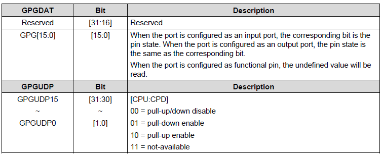
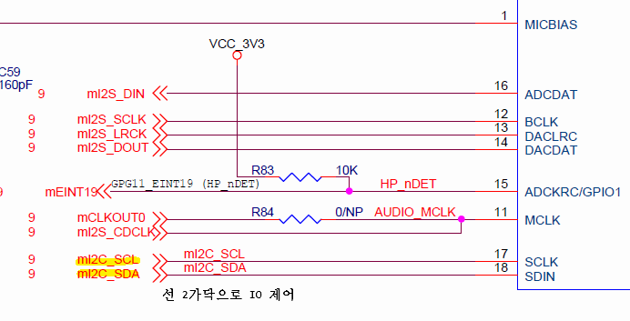
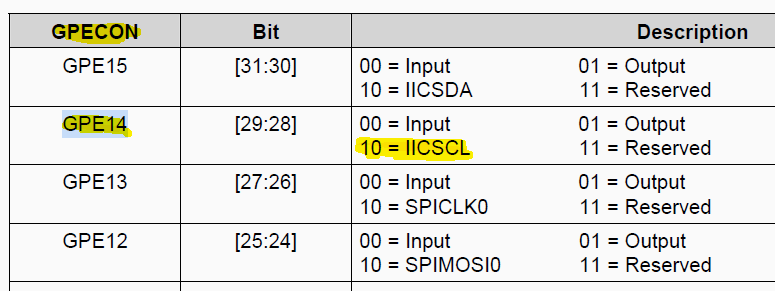
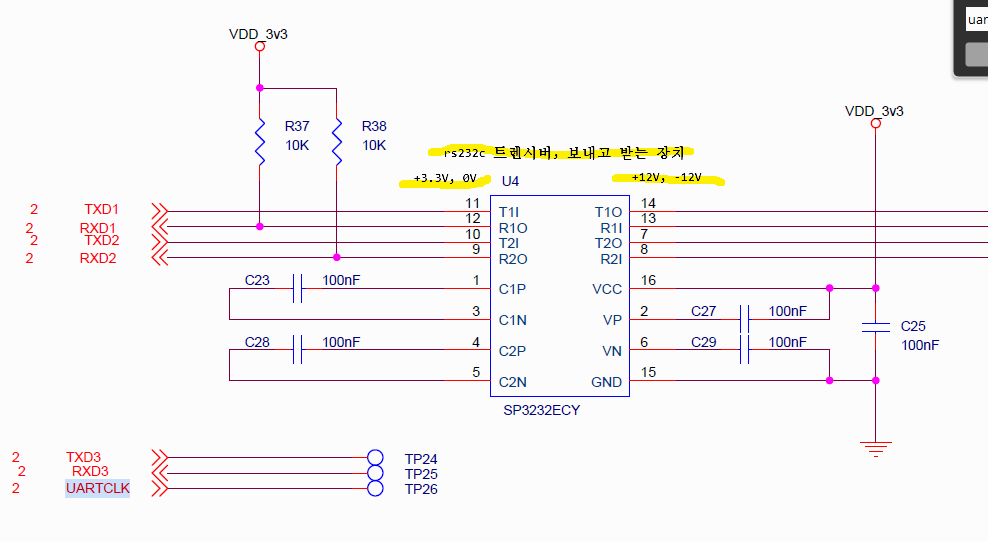
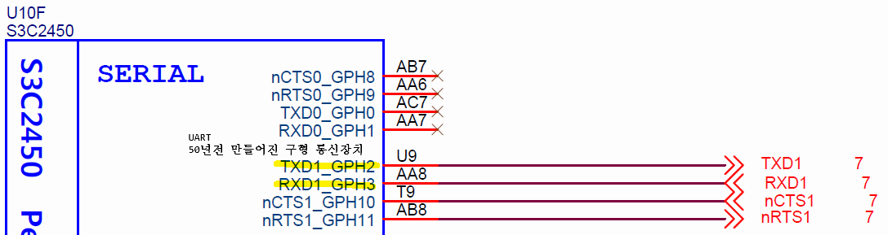
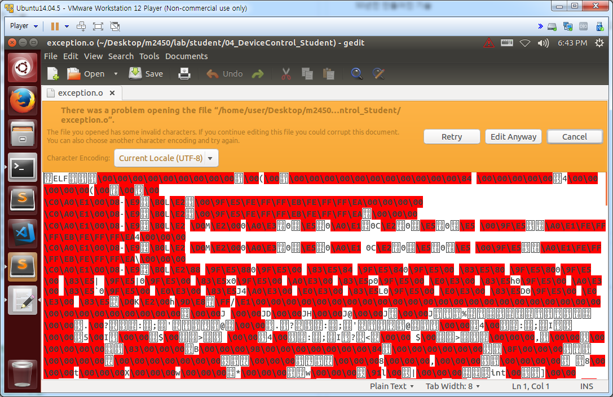
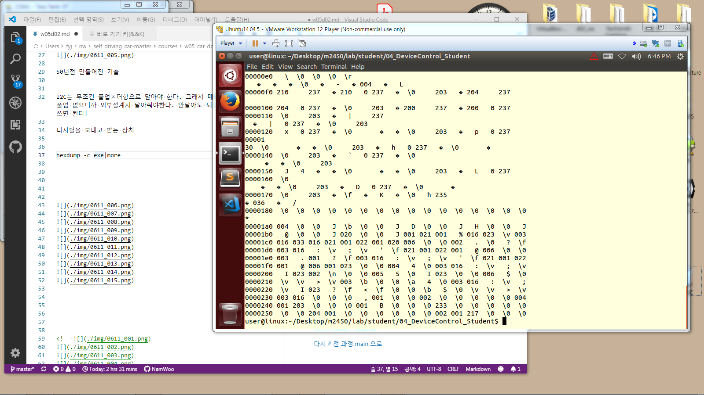
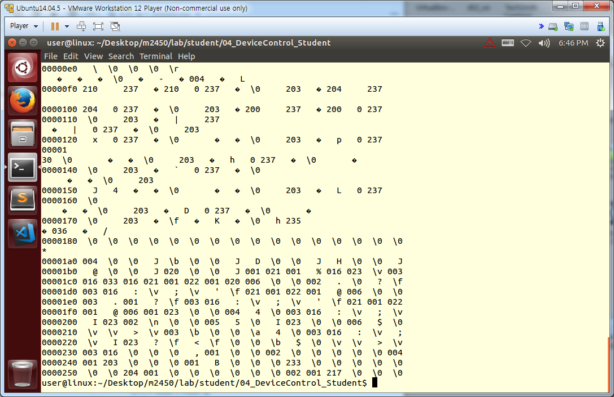
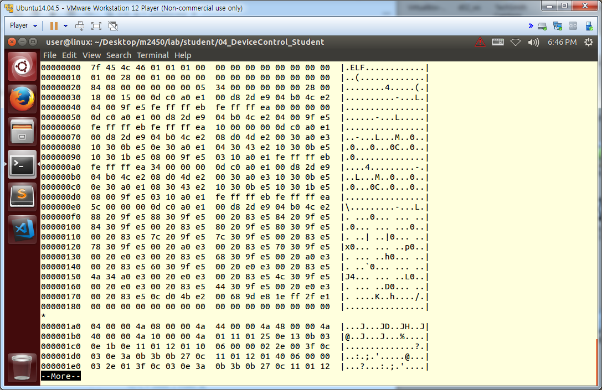
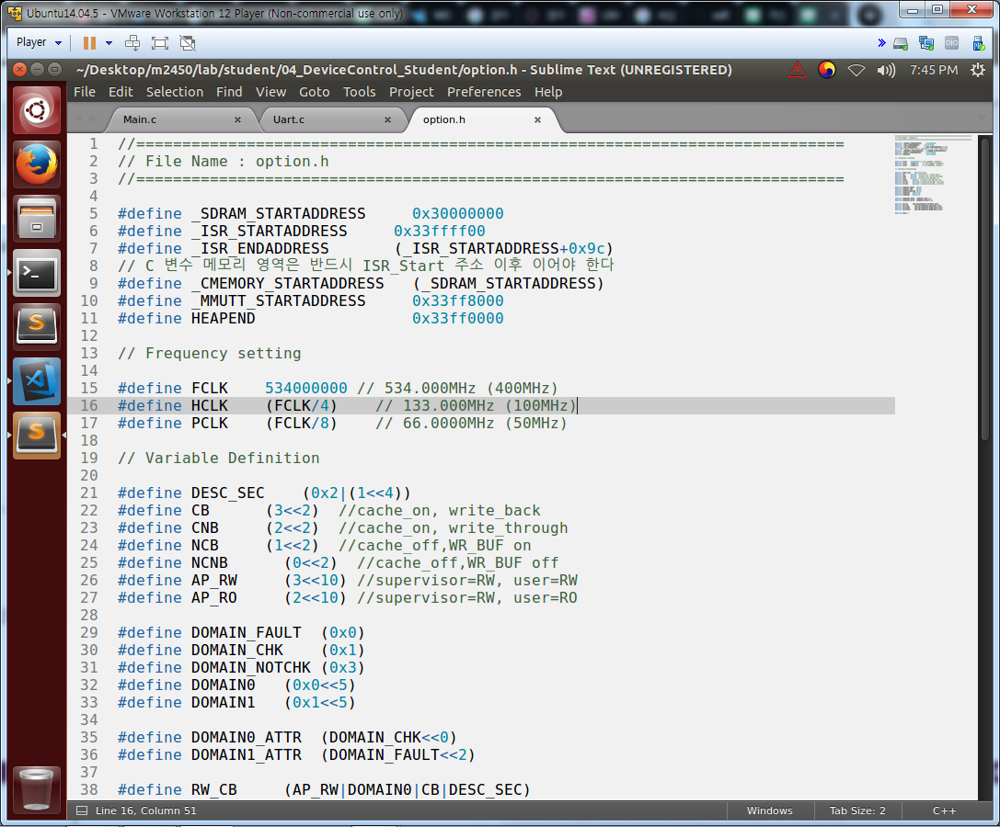
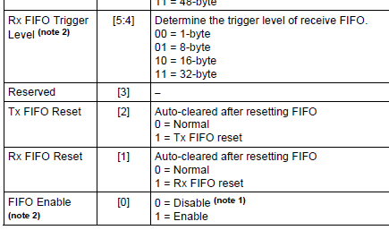
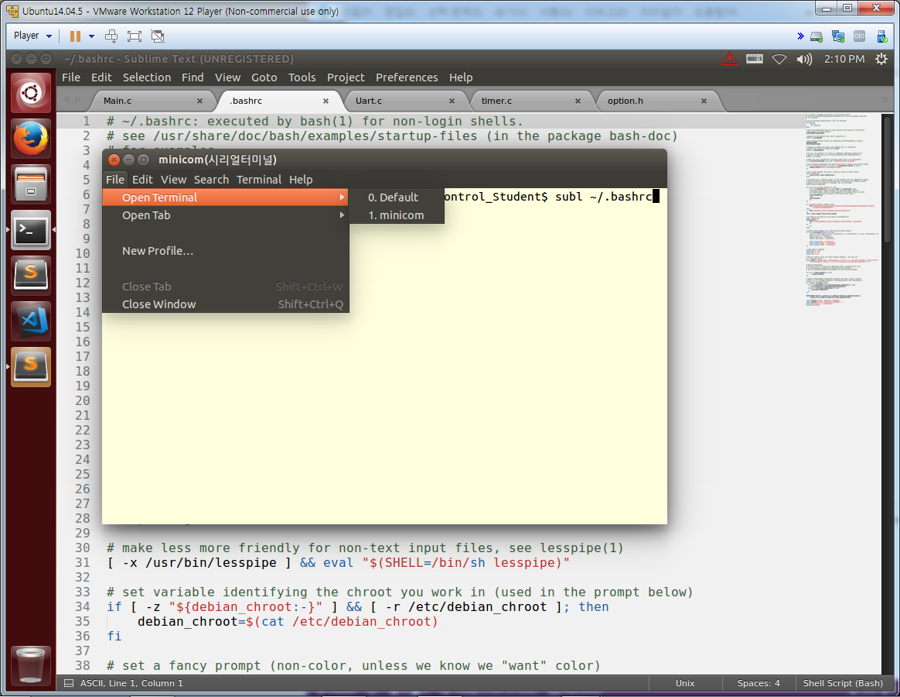
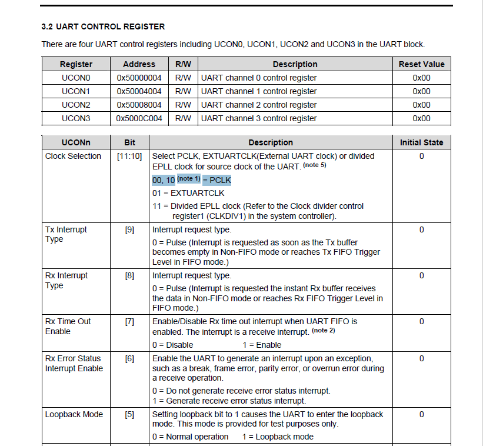
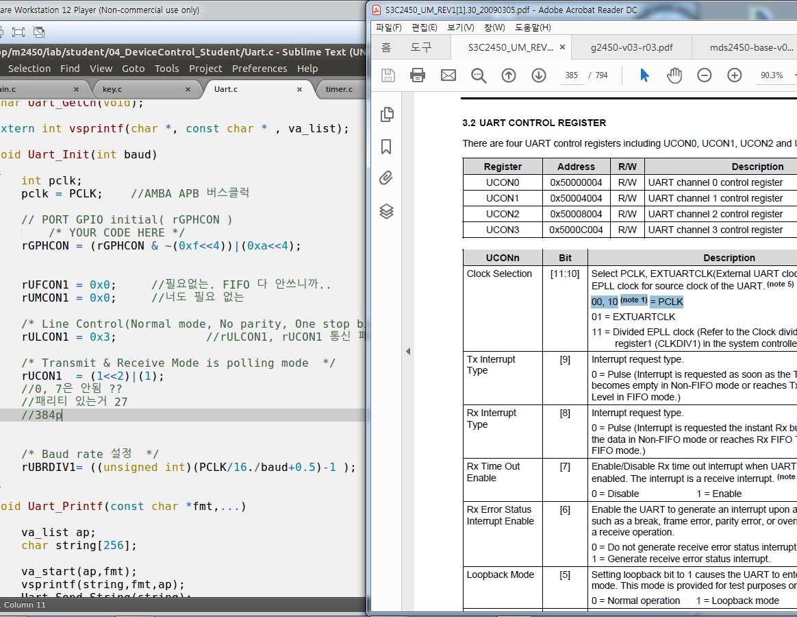
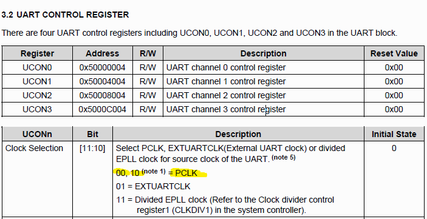
-->


---
[다시 # week 5 index 로](../w05.md)

[다시 # 전 과정 main 으로](../../README.md)


