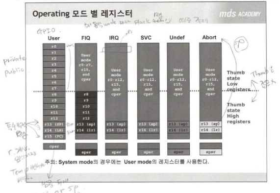

***6주차 1일차 20190617 수업***

***20190617 마지막업데이트***

# Week 6 - Day 1 - 차량용 프로세서 디바이스 이해와 활용

`전반적인 용어의 개략적 훑기! 자세한건 목요일날 다시 정리
`
## 임베디드 시스템의 구조

### 프로세서

프로세서의 구조
* 레지스터 Reg
* 산술논리연상장치 ALU
* 제어장치 CU
* 버스 BUS

내부버스, 외부버스가 있다, 파이프라인, 레지스터 지겹게 나올거다. 산술논리연산장치 ALU 지겹게 나올거다.  

MCU 에서 SoC 로 대세가 넘어가는 중이다.
* 성능 좋으면 이제 SoC 예전껀 MCU

기계어와 어셈블리어
* 머신랭귀지
  * Machine Language
  * `100101010010001111101010100111010110`
  * 이건 그냥 숫자일뿐, 컴퓨터가 이해하는 
* 니모닉코드
  * Mnemonic code
  * 유사어셈블리어
    * 기계어를 사람이 이해할 수 있도록 의미를 부여한 명령
* 어셈블리어
  * Assembly language
  * `mov r0, #0`
  * 사람이 이해할 수 있도록 의미를 부여한, 직접 프로그래밍 할 수 있게 만든 언어
* 과정
  * `mov r0, #0`  ->  `10101100101`
    * 어셈블러
  * `10101100101`  ->  `mov r0, #0`
    * 디스어셈블러

2진수는 기계를 위한, 16진수는 2진수를 가지고 사람을 위한


어셈블리어를 학습하는 이유! 어셈블리어가 중요한 이유!
* ***임베디드 시스템을 이해하기 위해***
* ***H/W 제어하는 느낌을 알아야 한다.***
* ***해당 아키텍쳐의 구조 및 동작에 대한 깊은 이해가 가능하다.***

Instruction 명령어
* OP 코드 `Operation Code`
  * 동사
* 오퍼랜드 `Operand`
  * 목적어

명령어 Set에 따른 프로세서 종류
* CISC complex instruction set computer
  * 1970~1990까지 CPU 설계기술 유행 intel, sumsung
    * intel 386 대표적 CISC 
* RISC Reduced Instruction set computer
  * 1990후반부터 이 기술이 트랜드 ARM 
    * ARM 1990후반 나와서 IT의 모바일 혁명과 같이 스타가 된

### BUS

* 어드레스 버스 adress bus
* 제어버스 control
* 데이터버스 data bus

폰노이만 아키텍쳐 vs 하버드 아키텍터
* 폰 노이만 같이 연결, 속도 하버드보다 느리다. 같은 버스 연결해서 공유하기에.
* 하버드 아키텍텨 ARM9부터 요새꺼까지 다.

### 메모리 장치
  
컴퓨터 켰을 때 OS 올라오기 전에 bootloader 화면, 이게 `ROM`
* 컴퓨터를 꺼도 날라가지 않는 비휘발성

종류를 보면 

* Volatile Memory
  * SRAM
    * 스테틱
      * `비싸다`
  * DRAM
    * 다이나믹
* Non-Volatile Momery 
  * EEPROM
    * `비싸다`
    * NAND도 NOR도 없던 시절 백악기시절에, 역사속 오래된.
    * 요즘엔 용량이 적은 메모리로 쓴다. 수십kbyte 굳이 이걸로 한다 
  * Flash
    * NAND
      * 프로그램 저장
    * NOR
      * `비싸다`

쉽게 해석하는 법.
* 비싸니까 속도 빠르다. 
* 비싸니까 용량 높지 않다.
* 싸니까 속도 느리다.
* 싸니까 용량은 많다.

DRAM 종류
* SDRAM
* EDORAM
* DDR2


#### Cache 메모리 시스템

* 일반의 경우 고속의 CPU가 버스 및 메모리 속도에 의존적이며 늦다.
* CPU 주변에 고속의 메모리를 두고 자주 사용되는 명령과 데이터를 저장하여 시스템 성능개선, 10배이상 속도 업!


#### MMU Memory Mangement Units

물리주소가 아닌 가상주소를 쓸 수 있다.


### 주변장치 

LCD,CPU LCD컨트롤러, `일반메모리버스 연결되어있다. LCD 안에 reg 많은게 그 증거다.`

I2C 와 다르다.

버스가 아닌거, 코드에는 IIS, I2C 이건 메모리버스 가 아닌 일반 커스텀버스, 기타버스이다. 

해야할 내용이나 한 내용들 일단 이런게 있다~ 훑고 지나가기

* IO-mapped device
* Memory mapped device 
* polling
* interrupt
  * CPU - 인터럽트 요청(iiq) - 인터럽트 제어기 - 인터럽트 응답(irq) - I/O
  * CPU - 인터럽트 응답 - Mask Pending 레지스터 - 인터럽트응답(irqack) - I/O
  * 인터럽트 벡터?
  * 인터럽트 벡터 테이블?
  * 인터럽트 벡터 테이블 구현방식? 모르겠다. 목욜날 나갈 예정.
* DMA


## ARM Architecture

2005년 브랜딩 작업 Cortex 나옴

arm 약자 하나씩 따서 했다는걸 이제 알았다니..
* Cortex A - 고성능
* Cortex R - 중간성능
* Cortex M - 저성능이기에 마컴 주로

후발주자기에 intel 계열의 little endian과 motorola 계열의 big endian 모두 지원

fast interrupt 고속 인터럽트 지원
* IRQ
* FRQ 가 성능 조금 더 낫다. 

리틀엔디언과 빅엔디언에 대해서

버스는 3가지, 어드레스 데이터 컨트롤

1. 리틀엔디언 하드웨어와 빅엔디언 하드웨어가 따로 있나?
   1. 예쓰
2. 컴파일러도 리틀엔디언 컴파일러와 빅엔디언 컴파일러가 따로 있나?


빅엔디언 하드웨어는 d16 d31에다 연결? 빅엔디언 하드웨어 설계법을 따르면 d1617181931까지 연결해야 하는 거다. soc의 핀 31번부터 16번까지.

16비트메모리에 32비트연결하면 빅,리틀 모두 돌아갈 수 있다. 하드웨어 특징은 수정이 안된다. 호환되게끔 하려면 적어도 외부에 페리페랄, 32비트짜리 상관없이 16, 8 맞게끔 연결해야한다. 


http://guileschool.com/

https://blog.naver.com/guile21c/58560578

<!-- <음5.s> -->

`int i`인 12345678까지 각 4byte인 정보를 메모리 주소에 적을 때 이게 되는게 있고 안되는게 있다. 
1. 0번지부터 쓰게 되면 잘 들어간다.
   * 빅이면 12.34.56.78
   * 리틀이면 78.56.34.21
2. 1번지부터 쓰기 시작하면 ***문제가 생긴다. 안된다.***
```
메모리
0  1  2  3
XX.12.34.45
78.         // 이렇게 밀려서 들어간다
```
* 안되는 이유
  * int 정수형 4byte는 한 줄인 4의 정수배 주소에만 들어가게 된다. 
  * 0번지 아니면 4번지 아니면 8번지, 그러니까 각 줄에 첫칸만, 이게 정수배 주소다.
  * 이게 1번지부터 쓰기 시작하면 안들어간다. 반칙이다. 이 현상이 `ABORT` 다
* `ABORT : 비정상적인종료`  
  * 이 동작을 실행했던 프로그램이 비 정상적인 종료하게 되는.
  * 정렬된 주소가 어떤건지 알게 되면 엑세스 하려고 하는 데이터의 정수의 주소. 그러니까 4byte의 경우 4의 제곱승, 같은 2의 정수배 주소
  * 1byte만 쓸 때는 제약사항이 없다. 1byte 정수배주소는, 모든 주소 다 된다. 
  * 0.4.8.12 문제없다. 
* `Aligned Access` 
  * 문제없이 들어간다는게 결국 ARM에서 사용하는 데이터 Type 2의 정수배 중 하나인 `word` 단위로 `Access` 한 것이 `Aligned Access` 정렬 액세스 라 한다.
  * 정렬되지 않은 것은 문제가 있다. 
  * `word`가 32 16 8 bit! 
* `Un-Aligned Access` 
  * `비정렬 액세스` 라 한다.
  * 이때 `ABORT` 발생! 비정상종료!

> Q데이터버스??

### Operating Mode 

* `SVC`
  * `/etc` 아무거나 지우려고 할때 나오는 오류
  ```sh
  /etc$ rm wodim.conf
  permission denied
  ```
  * 이건 su 로 root 권한 변경하면 되고 이게 `SVC` supervisor Mode

이렇듯 Operating mode는 현재 프로세서가 어떤 권한을 가지고 어떤 종류의 작업을 하고 있는지 나타낸다. 

* 시스템 자원을 관리할 수 있는 오퍼레이팅 시스템 커널 관리 시스템?
  * user mode
  * fiq 인터럽트 헨들러
  * irq 인터럽트 헨들러 이 모드에서 동작
  * svc
  * abort mode
  * undefined mode
  * system mode
* 저가형 avr 에는 없다. 고성능에만 이런 mode가 있다.

커널에서 사용하게 되면 각 모드가 돌아가고 그 모드는 총 7개의 mode가 있다. 


* Abort mode
  * 비정렬 액세스 때 실행
* Undefined mode
  * 정의되지 않은 명령, 수행하려고 하면 수행되는 프로세서의 동작
* syetem mode
  * 애매한 모드
  * user, svc mode와 비슷하지만 쓰임새가 다르다. 
  * privilege mode

Operating 모드의 변경

저가형 마이크로컨트롤러, 익셉션, 인터럽트와 같은 의미다. 여기서는 ARM에서는 `Exception`. 약간 더 광범위한 범위다. 
* `Exception`
  * 정상적인 IRQ, FIQ 포함한
  * 비정상적인 것들 모두!
    * 비정상의 대표적 ABORT

### ARM Processor 의 레지스터

#### ARM 레지스터의 종류

* 총 37
* 30개의 범용 레지스터 (general purpose)
* 1개의 프로그램 카운터 (pc, program counter)
* 1개의 cpsr (current program status register)
* 5개의 spsr (saved program status register)


32bit 길이의 37개 레지스터가 있다. 

* 30개의 범용 General purpose
  * r01 ~ r15까지
* 특수목적 reg
  * pc
  * cpsr
  * spsr
  * lr
    * r로 시작하지 않는다.

레지스터 사용하지 않는 코드가 없다. 레지스터 잘 알고 있어야 한다.

* 하드웨어 레지스터 (hardware register)
  * 입출력을 위한 저장공간, 주변장치, 내부에 있고 메모리맵(주소), io맵 방식을 쓴다.
  * intel은 메모리멥 io를 지원 
  * intel chip은 포트맵 io를 지원 
* 프로세서 레지스터 (processor register)
  * 컴퓨터에 프로세서 내에 자료보관을 아주 빠른 기억장소에? 계산시에 시행? `특수기능 수행` 
  * `RISK` 프로세서다. CISK는 ARM이 아니니까. RISK 인걸 다시 확인
* 시프트 레지스터 (shift register)


<!--  -->

#### Stack Pointer (SP)

`스텍포인터 레지스터`

* sp, r13 
  * stack pointer
  * 특수목적 reg 로 반드시 메모리 주소를 가지고 있어야 한다. 
  * 32bit 주소 담을 수 있다. 포인터변수 같은. 어떤 놈을 가리키는 주소가 들어있다. 

`sp-4 번지`

>왜 +4 도 아니고 -4 인가?

>스택메모리가 무엇인가? 스텍메모리가 왜 필요하고 왜 만들었을까? 스텍메모리를 지역변수로 쓰면 장점이 무엇인가?

* LIFO(시간적으로 제일 나중에 기록된 정보가 제일 먼저 읽히는 자료 처리 방식) 마지막 입력한게 먼저 나오는거. 이건 현상. 더 중요한건 어디다 쓰는거. 
* 동적메모리 malloc 이거 때문에 만들었다. 메모리는 유한한데 그 메모리를 효율적으로 잘 활용하기 위한 것이 스텍메모리. 힙메모리도 그렇게 만든 것
* 무슨차이? 힙 메모리는 내가 필요할 때 잡고 필요없으면 해제, 또 그 메모리는 다른 용도로 대신할 수 있다. 
  * 버스 하나 사놓고 통근버스, 유치원버스, 관광버스로 활용하는 것.
* 스텍메모리는 함수에 안으로 들어가면 생성되고 빠져나가면 자동으로 해제되는 메모리. func1에서는 A로 사용되던 메모리가 func2에서는 B로 사용되는 메모리다. 

결국 *공통점은 효율적으로 쓰려고* 결국 sp 읽을 때도 기록할 때도 sp 만 가지고 사용할 수 있다. 원점만 잡고 거리를 계산해서 접근하는. 왜냐면 4바이트, 자동으로 변수 지정. 

스텍포인터 레지스터는 스텍메모리 접근할 때 쓰는 포인터 변수를 스텍포인터 레지스터라 한다. 그럼 왜 빼기 4? 뺴기8? 

* ARM 같은 경우 high adr에서 low adr 로 사용하게 되어 있다. *말 그대로 상위 어드레스부터 하위 어드레스 방향으로*.
  * 풀 디센팅 스텍 구조.
  * 그래서 맨 위부터 시작하기 +4가 아니라 -4나 -8로 표현하게 되는 것

`r13` 보다 `sp` 가 더 많이 쓰인다. 

그림에 각 동작모드 7개 다 나와있는데 스텍포인터 레지스터 sp가 다 그려있다. ARM 에는 동작모드마다 sp가 있어야 된다는 말

#### Link Register (LR)

Link. go to

브렌치 다른 말은 goto
그 링크랑 이 말과 관계가 있다. 

링크 레지스터 가지고 브렌치한다?

#### Program Counter (PC)

프로그램을 *수행하는*(fetch), *읽어내는* 위치를 저장하고 있는 reg
* 읽어내는 위치, 실행하는 위치 다르다. pipe line processor

1000 메모리라 했을때 1002, 1004 가 되는 이유

`프로그램 카운터 포인터 레지스터` 다.

스텍포인터 레지스터, 포인터 레지스터 특징은 sp-4. sp-8 같이 pc도 마찬가지 가리키고 있는 주소는 pc+4(다음명령), pc+2가 된다. 자동으로 증가한다. 

>여기 다시 확인!

*sp 스텍 포인터 레지스터는 스텍에 있는 데이터 접근할 때*  
*pc 프로그램 카운터는 프로그램 접근할 때 쓴다.*

* 근데 이 스텍포인터와 다른 점은 스텍포인터를 가리키기에 읽기+쓰기 가능하다. 
* 하지만 옌 `읽기`만, 프로그램 가리키니까. 읽어낼 위치 가리키니까
  * 이게 바로 파이프라인 프로세서
  * 읽어낼 위치, 실행할 위치 다른
    * 정확하게는 틀린 말??


#### 인터럽트 핸들러

어셈블리로 인터럽트 헨들러 만들어보자.

인터럽트 처리할때 맨 먼저 호출
마스터 핸들러에서 DMA1,2,4 이런 식으로 함수 호출 
이게 바로 마스터 핸들러, 어셈블리로 만들어진, 여기서 서브핸들러 호출하게 되어있는, 타이머인터럽트는 DMA1이든.

그래서 이건 인터럽트 핸들러 맞는데 여기 인터럽트 핸들러 안에서도 레지스터 언제든 쓰고 있다.


<!-- 음5,46:00 -->
그림을 보면

r1 은 동작모드마다 존재하는데 물리적으로는 같은 레지스터다. `동작모드 전환`, 나중에 하겠다.


<!-- 음6,00:00 Assembly Language 첫실습-->


### `Assembly Language` 실습시작

#### C랑 비교해보기

* assembly 
    ```s
    ldr r0
    ```
* C
    ```
    void HOW_TO_RETURN(void)
    {
        return;
    }
    ```
* `@`, `/* */` : assembly 에서 주석

#### 레이블

어셈블리에서 레이블은 만능. 함수이름, 배열이름, 변수이름 콘스탄트 변수이름 뭐든 변신할 수 있는 것들.

* @레이블 작성법 /* */
  1. 알파뉴메릭( _ 포함)으로 작성
  2. 1번 COL에 작성, 젤 첫칸에 쓰라는 말 (컴파일따라 다를 수 있으니)
  3. 콜론(:) 은 있을 수도 있고 없을 수 있다.. 어떤 컴파일은 안될 수도 있다.
     * HOW_TO_RETURN: /*레이블*/ 하면 한글이 써졌으니 코드 utf8로 바뀜

```
DATA_PROCESS1:
	add r0, r0, r1
	sub r0, r2  
	mov pc, lr	
```

add rd, rs op2

* op code
* destination reg
  * ALU 버스를 통해 레지스터 뱅크에 write
* operand1
  * A버스를 통해 ALU에 입력 source 레지스터
* operand2
  * B 버스와 Barrel shifter를 통해 ALU에 입력


mov r0, #0 이렇게 하면 레이블은 아니다. 
명령어는 탭문자! 공백~! 두칸, 4칸.
탭 많이 쓰지 말아라. 


대문자면 초지일관 대문자. 소문자는 소문자.

op코드? 하나로 밀고 가자. 소문자 추천.
레지스터 일반적이게 소문자.


브렌치 위드 링크 goto

링크레지스터를 가지고 브렌치한다 이걸 씨에서는 함수호출


bl HOW_TO_RETURN
* LR = 복귀주소(리턴어드레스 저장주소 가 LR)
* PC = 이동할 함수 주소
이렇게 하면 프로그램이 bl로 이동

```
bl	HOW_TO_RETURN
	.loc 1 30 0
	ldr	r0, .L2+12
```
```
.globl  HOW_TO_RETURN
```

글로발 해야 다른 파일에서 접근 가능.

슈도코드 유사어셈블러, `.globl` 이다.
sl

니모닉 코드 디렉티브즈 

`. 붙어이으면 다 지시어 니모닉코드 유사코드 directives(지시어)`

```
b . @while(1); 어셈블리 무한루프 . self의미 나한테 가는 의미.
```

#### 전달인자 전달방법

전달인자 방법, 리턴값 받는 방법 배우겠다. 이따가.

전달인자를 레지스터를 통해서 전달받는다?

dis 파일하고 -S 파일 컴파일때 뽑아주고

```bash
user@linux:~/Desktop/m2450/lab/student/01_Hello_ARM_Student$ /opt/CodeSourcery/Sourcery_G++_Lite/bin/arm-none-eabi-gcc -c -I/home/user/Desktop/m2450/lab/student/01_Hello_ARM_Student -I/opt/CodeSourcery/Sourcery_G++_Lite/arm-none-eabi/lib/include -I/opt/CodeSourcery/Sourcery_G++_Lite/lib/gcc/arm-none-eabi/4.5.2/include -g -Wall -Wstrict-prototypes -Wno-trigraphs -O0 -fno-strict-aliasing -fno-common -pipe -march=armv4t -mtune=arm9tdmi -fno-builtin -mapcs -S -o Main.S Main.c
```

C 에서 선언해주고
```c
int HOW_TO_RETURN(int,int,int,int,int,int,int);
```

```
mov	r3, #5
str	r3, [sp, #0]
mov	r3, #6
str	r3, [sp, #4]  6이 여기 써지고
mov	r3, #7   ㄱ3 7s넣으면 
str	r3, [sp, #8]  일로 들어가는
mov	r0, #1
mov	r1, #2
mov	r2, #3
mov	r3, #4
```

4번째이후부턴 스택을 이용해서

sp 가 가리키는 곳에 들어가는

ㅇ리부는 레지이용해서 넘기고 일부는 여기로

또 속도도 스택이 훨씬 느리다.

매개변숮 ㅓㄴ달방법, C언어랑 어셈블리 호출관계

`ATPCS(ARM/Thumb Procedure Call Standard)`

75p

psr레지스터부터 시작.


## 동작모드의 변환

operating Mode

IRQ 모드비트 어떻게 바뀌어야 할까?

Mode 10010
I/F 0/ x dont care
T bit 0


```Makefile 62
$(OBJDUMP) -d $(TOPDIR)/MDS2450 > $(TOPDIR)/MDS2450.dis
```


```
	.globl IsrIRQ
IsrIRQ: 
        sub     sp,sp,#4       //reserved for PC
        stmfd   sp!,{r8-r9}   
```

4차원세계 이상한 나라의 폴 예

```
cd ..
cd 04_De
subl .
```

c에서 하는 방법
__attribute__(()) 이게 동작모드 동시 업데이트 기능, 동작모드 동시 복원되는 거다. 이거 없으면 그냥 부

어셈블리로 하는 방법도 배울 것이다.


---
[다시 # week 5 index 로](../w06.md)

[다시 # 전 과정 main 으로](../../README.md)


<!-- Here's a simple footnote,[^1] and here's a longer one.[^bignote]

[^1]: This is the first footnote.

[^bignote]: Here's one with multiple paragraphs and code. -->