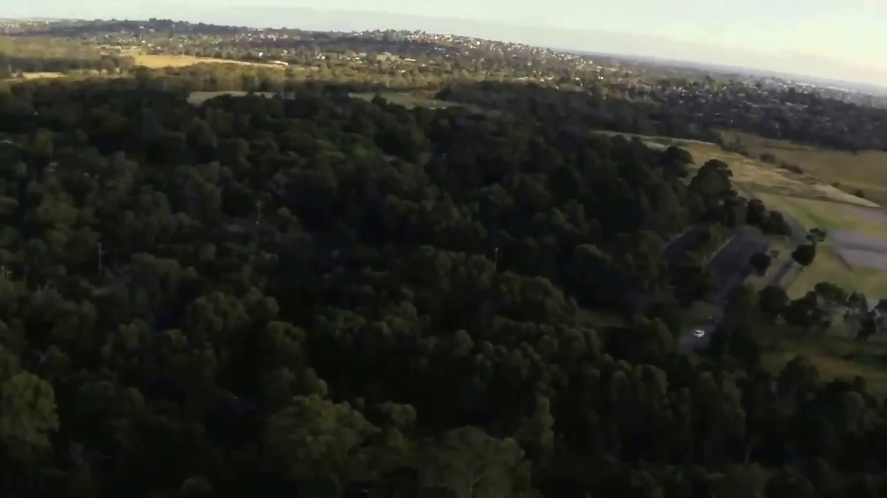
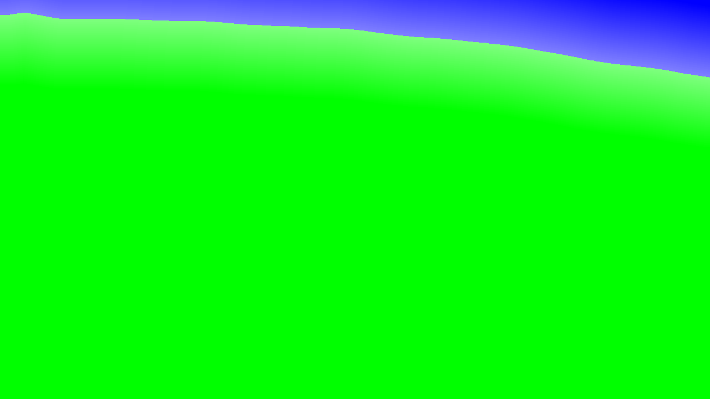
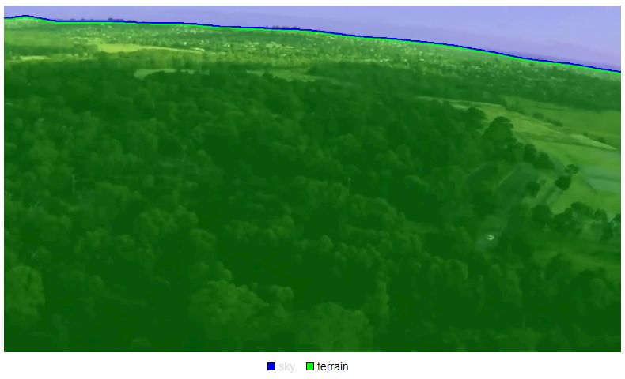
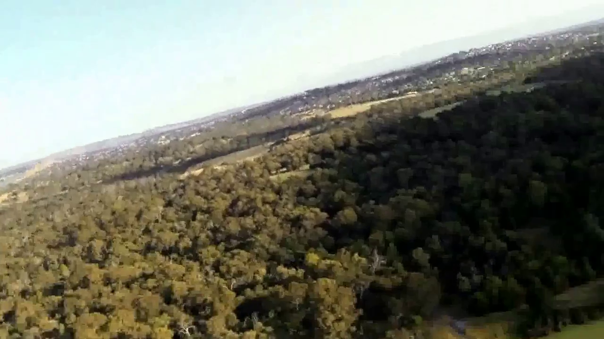
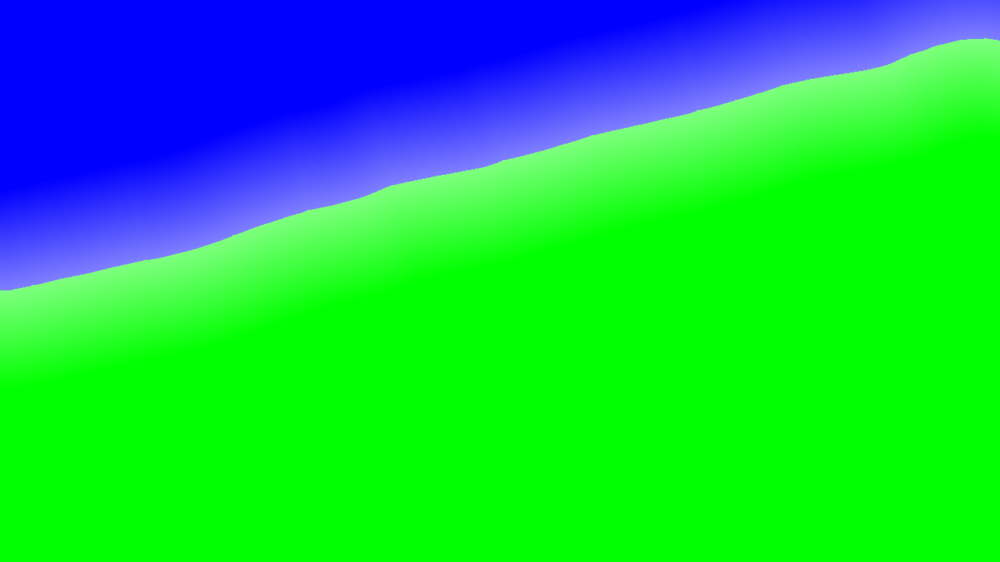
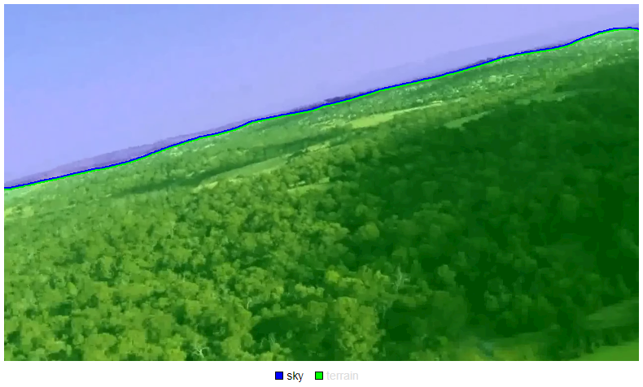

# 

* Dataset size 드론 촬영 이미지
  * 5.98 GB
* Entry Count
  * 45
* Feature shape 
  * (3, 720, 1280)
* Label shape 
  * (1, 720, 1280)

## second test

입력 이미지

출력 이미지

이미지 마스크

## first test 

입력 이미지

출력 이미지

이미지 마스크

tensorRT 보드가 뭐냐에 따라 다르다.

digits 는 까패로 할 수 있는 것은 디텍션이든 뭐든 고치거나 손대기가 히믇ㄹ다?

resnet 무겁고 정말 이것까지 해야하나? 별로잘 안썼는데 올해부터 resnet50 101 10 이렇게 만들어져서 보다 대중적으로 사용되는 추세다.
vgg는 16이 fn 전까지 때서 많이 사용한다. 좋다. fn은 교육때만 쓴다.

r2c

씨리얼 i2c

맥스웰 <<< 파스칼 <<< 볼타
나노젯슨
tx1 젯슨
tx2 젯슨
drive-px2 파스칼

자비에 로보텍스 페가수스 드라이브 자비에?
jetson 볼타

ai가속기가 넘사벽 
TensorCore
Int8
레지스터 바꾸고 연결하면 켄통신 할 수 있다.

자비에 키네틱 안되서 단점. 하지만 욜로 트레이닝 가능하다.

# 

이세상에 존재하는 오브젝트 디택션은 3가지가 있다.

* Faster R-CNN
  * 비교적 오래되고 빠르지 않지만 특별한 케이스에서 많이 사용되고 있다. 특별히 뭔가 찾아내야한다? 그럼 무조건 이거다. 하지만 실시간성을 가져오기 그렇게 좋지 않다. 자비에에 올려도 버벅, 미끄럽지 않다. 성능보단 정확도, 구글첼린지는 정확도 우선, 사진에 창문속에 비친 화분속에 어항 속에 물고기 구분 같은 느낌 같은 느낌?
  * 그 외에는 카메라로 하는 것들 대부분 밑에 두 가지를 더 많이 사용한다.
* Darknet YoLo
  * nvidia에서 detection 은 yolov2 개조해서 사용한것과 같다고 말씀
* SSD

코딩룰. 인증. 세계적 C 의료

세이프티..
미즈라 코딩모델
모터인더스터리

릴라이언스 어소시에이;

아산병원,

